# MEnglish ERP — Tài liệu Thiết kế Hệ thống

> **Phiên bản:** 1.1 · **Ngày:** 25/09/2026 · **Tác giả:** CTO
> **Thay đổi v1.1:** bổ sung mục 15 (UI Fidelity: bám sát mockup), ADR-11, chốt Tailwind 3.4, cập nhật S0/S1 và Definition of Done.
> **Trạng thái:** Draft, chờ review BA/Ban giám đốc
> **Nguồn đầu vào:** 2 file BPMN (`ba-bpmn-doc-kieulien-english-flowchart*.drawio`, Bước 1–22), 60+ UI mockup (CRM, Học phí, Epic 5/6/7/8/13, Syllabus, Phân công công việc, Test đầu vào), `erp-database-schema.html`, `tai-lieu-su-dung-flow-tinh-nang.html`, `test-cases-unitest-flows.html`, `Thang điểm + hướng dẫn nhận xét.html`, `unitest-crm.xlsx`.

---

## Mục lục

1. [Bối cảnh & Quyết định kiến trúc](#1-bối-cảnh--quyết-định-kiến-trúc)
2. [Phạm vi nghiệp vụ](#2-phạm-vi-nghiệp-vụ)
3. [Tech stack](#3-tech-stack)
4. [Kiến trúc tổng thể](#4-kiến-trúc-tổng-thể)
5. [Cấu trúc module & quy tắc code](#5-cấu-trúc-module--quy-tắc-code)
6. [Thiết kế từng module (Bounded Context)](#6-thiết-kế-từng-module-bounded-context)
7. [Thiết kế Database](#7-thiết-kế-database)
8. [Luồng nghiệp vụ xuyên module](#8-luồng-nghiệp-vụ-xuyên-module)
9. [Phân quyền & Bảo mật](#9-phân-quyền--bảo-mật)
10. [Tích hợp bên ngoài](#10-tích-hợp-bên-ngoài)
11. [Hạ tầng, CI/CD, Vận hành](#11-hạ-tầng-cicd-vận-hành)
12. [Chiến lược kiểm thử](#12-chiến-lược-kiểm-thử)
13. [Gap Analysis & Câu hỏi cần BA chốt](#13-gap-analysis--câu-hỏi-cần-ba-chốt)
14. [Kế hoạch Sprint & Theo dõi tiến độ](#14-kế-hoạch-sprint--theo-dõi-tiến-độ)
15. [UI Fidelity — Bám sát mockup](#15-ui-fidelity--bám-sát-mockup)

---

## 1. Bối cảnh & Quyết định kiến trúc

### 1.1 Bối cảnh

- Trung tâm Anh ngữ MEnglish (Kiều Liên English), **nhiều chi nhánh** (Cầu Giấy, Ba Đình, Đống Đa, Hai Bà Trưng…). Quy mô nhân sự 50, sắp tới 100–150. Học viên ~2.500, dự kiến 5.000–8.000.
- Chưa có code. Có đầy đủ BPMN TO-BE, UI mockup và một bản phác schema (Laravel/MySQL) làm tham chiếu.
- Team: **1 dev fullstack + CTO hỗ trợ trực tiếp**.

### 1.2 Các quyết định kiến trúc (ADR tóm tắt)

| # | Quyết định | Lý do | Đánh đổi |
|---|---|---|---|
| ADR-01 | **Laravel Modular Monolith** thay vì microservices | 1 dev không vận hành nổi 10+ service, message broker, distributed transaction. Closing Wizard cần ACID xuyên CRM → Học vụ → Tài chính. Tải thực tế (<200 user đồng thời) rất nhỏ. | Không scale độc lập từng module. Bù lại: module có ranh giới cứng, **tách được thành service khi cần** (xem ADR-05). |
| ADR-02 | **MySQL 8.4 LTS** | Theo yêu cầu. Nghiệp vụ OLTP thuần, không cần tính năng đặc thù PostgreSQL. | Partition MySQL không hỗ trợ FK → chỉ partition bảng log. |
| ADR-03 | **Blade + Livewire 3 + Alpine.js + Tailwind** | Giữ Blade theo yêu cầu. Mockup đã viết bằng Tailwind nên port gần như 1:1. Livewire lo phần tương tác (Kanban, Wizard, form động) mà không cần viết API + SPA. | FE gắn với BE. Nếu sau này cần app mobile phụ huynh thì bổ sung module API riêng (Sanctum), không ảnh hưởng core. |
| ADR-04 | **Redis** cho cache, session, queue (Horizon), lock, rate limit | Tách tác vụ nặng (tính lương, gửi ZNS, import Excel, xuất báo cáo) ra khỏi request. | Thêm 1 thành phần cần giám sát. |
| ADR-05 | Module giao tiếp **chỉ qua Contract (interface) + Domain Event**, cấm truy cập Eloquent Model của module khác | Giữ khả năng tách service. Kiểm soát bằng arch test (Pest) + Deptrac trong CI. | Viết thêm lớp Contract/DTO. |
| ADR-06 | **Transactional Outbox** cho side effect bên ngoài (ZNS, VNPT, email) | Không gửi tin cho phụ huynh khi transaction rollback. Retry an toàn. | Thêm bảng `outbox_messages` + worker. |
| ADR-07 | Tiền tệ lưu **BIGINT (đơn vị VND)**, không dùng float/decimal lẻ | VND không có phần thập phân, tránh sai số làm tròn. | Tỷ lệ % lưu `DECIMAL(5,2)`, làm tròn bằng hàm dùng chung. |
| ADR-08 | Sổ công nợ dạng **Ledger** (bút toán bất biến) + số dư cache | Hoàn phí, chuyển nhượng, hủy hóa đơn đều truy vết được. Sửa được race condition (Gap #3 trong test report). | Truy vấn số dư dùng cột cache, cập nhật dưới `SELECT … FOR UPDATE`. |
| ADR-09 | Cấu hình có **hiệu lực theo thời gian** (`effective_from/effective_to`) cho đơn giá GV, mốc hoa hồng, công thức lương | UI yêu cầu lịch sử đơn giá. Kỳ lương đã chốt không bị tính lại. | Truy vấn cần điều kiện theo ngày. |
| ADR-10 | Triển khai **k3s**, MySQL chạy **ngoài cluster** (VM riêng) | App stateless dễ rolling update. DB stateful để trên VM giúp 1 dev backup/restore dễ, không phụ thuộc operator. | Thêm 1 VM. |
| ADR-11 | **Giao diện bám sát mockup**. Nguồn chuẩn = `code.html` render bằng **bộ token chung** (trích từ 66 mockup), **Tailwind 3.4** (cùng engine với mockup), có visual regression test. Lỗi hiển thị trong mockup được sửa theo ý đồ thiết kế | Người dùng chốt 25/09/2026. Bộ token chung tái hiện 60/66 màn giống hệt khi nhìn bằng mắt (53 màn khớp từng pixel, 7 màn lệch < 1%). 6 màn còn lại lệch vì lỗi hoặc biến thể của chính mockup. `screen.png` có màn chụp từ bản lỗi nên không dùng làm chuẩn pixel | Không giống ảnh chụp 100% ở các màn mockup bị lỗi. Chi tiết mục 15 |

---

## 2. Phạm vi nghiệp vụ

### 2.1 Ánh xạ BPMN → Module

| Bước BPMN | Nghiệp vụ | Module | Màn hình mockup |
|---|---|---|---|
| 1–2 | Tiếp nhận lead, tư vấn, hẹn test | `Crm` | Pipeline Kanban, Danh sách khách, Thêm/Sửa khách, Chi tiết khách, Nhập hàng loạt |
| 2 (test) | Test đầu vào online/offline, chấm tự động, nhận xét | `Assessment` | DS đề test, Tạo đề, Chi tiết & nhận xét, Thang điểm |
| 3 | Học thử, xin feedback, lý do fail | `Crm` + `Academic` | Khách không chốt, Báo cáo doanh số |
| 4 | Chốt lead & xếp lớp (Closing Wizard), chờ xếp lớp | `Crm` → `Academic` → `Finance` | Chốt & Xếp lớp, Khách chốt thành công, Xác nhận chính thức |
| 5–6 | Cấu hình ca, phòng, giáo trình; TKB; khai giảng | `Academic`, `Organization` | Cấu hình Trình độ, TKB, Dashboard lớp học |
| 7 | Soạn & giao syllabus theo chặng | `Curriculum` | Soạn syllabus, Giao chặng, Tài liệu giáo trình, Đề xuất sửa GT, Điều chỉnh tiến độ |
| 8 | GV xem lịch, nhận chặng & dạy | `Academic`, `Curriculum` | Portal GV |
| 9, 9b | Chấm công & chốt bảng công | `Timekeeping` | Chấm công thủ công, Chi tiết chấm công GV, Lịch sử đồng bộ |
| 10, 10b | Điểm danh, đối soát điểm danh | `Academic` | Dashboard lớp theo ngày |
| 11, 11b | Xếp lịch & dạy bổ trợ cho HV vắng/yếu | `Academic` + `Operations` | Báo cáo trực lớp (HV cần bổ trợ) |
| 12a, 12b | Duyệt & cung ứng đề Big Test, test theo chặng, nhập điểm | `Curriculum` | Duyệt & phân phối đề, Nhắc lịch Big Test, Duyệt KQ & gửi PH |
| 13 | Chăm sóc HV, sinh nhật | `Crm` (Care) | Chi tiết khách: "Chăm sóc tháng đầu" |
| 14 | Cổng PH/HV xem tiến độ | `Portal` | (chưa có mockup) |
| 15, 15b | Lập phiếu thu, duyệt, xuất hóa đơn/biên lai | `Finance` | DS thu phí, Lập/Duyệt phiếu thu, Lịch sử thu, Dải số HĐ, Tài khoản NH, Nhắc nợ, Thu phí quá hạn |
| — | Hủy HĐ, hoàn phí, chuyển nhượng, khất nợ | `Finance` | Duyệt/Hủy hóa đơn, Hoàn tiền & Khất nợ |
| 16 | Tính lương & duyệt | `Payroll` | DS bảng lương, Chi tiết lương (4 mẫu), Đơn giá GV, Mốc hoa hồng, BXH KPI, Lương của tôi |
| 17 | Trừ lỗi & kỷ luật | `Discipline` | Danh sách vi phạm |
| 18 | Kho sách/hàng hóa | `Inventory` | (chưa có mockup) |
| 19 | Người dùng, hồ sơ nhân sự, audit | `Identity`, `Hr`, `Audit` | Tài khoản & Vai trò, Phân quyền cá nhân, Nhật ký vận hành |
| 20 | Kanban giao việc 2 chiều, TA 3 ca | `Operations` | DS công việc, Giao việc, Giao việc TA, Nhiệm vụ hôm nay, Báo cáo trực lớp, Xác nhận hoàn thành, KPI tự động |
| 21 | Ôn thi học kỳ trường | `Curriculum` | (chưa có mockup) |
| 22 | Dashboard theo vai trò | `Reporting` | Báo cáo doanh thu tạm tính, Khoản chi vận hành, Báo cáo DS |
| — | Cấu hình hệ thống | `Organization` | Danh mục, Ngày nghỉ, Nhắc nợ, Tài khoản NH |
| — | Helpdesk, thông báo | `Support`, `Notification` | (theo tài liệu flow) |

### 2.2 Vai trò (Actors)

| Mã role | Tên | Ghi chú |
|---|---|---|
| `admin` | Quản trị / Giám đốc | Toàn quyền, duyệt lương, duyệt hủy HĐ |
| `manager` | Quản lý cơ sở (CM) | Giới hạn theo chi nhánh |
| `accountant` | Kế toán | Duyệt phiếu thu, hủy HĐ, soát lương |
| `academic_staff` | Học vụ | Lớp, xếp lớp, điểm danh, bổ trợ |
| `academic_head` | Học thuật (HT) | Giáo trình, Big Test, chốt phạt học thuật. **Tách khỏi `academic_staff`** vì BPMN phân biệt HT và Học vụ. |
| `sales_consultant` | Tư vấn viên | Chỉ thấy lead của mình |
| `teacher` | GV / GVNN | Portal GV |
| `assistant` | Trợ giảng (TA) | Portal TA |
| `student` / `guardian` | Học viên / Phụ huynh | Portal PH/HV. **Thêm `guardian`** vì BPMN có làn PH riêng. |

### 2.3 Phạm vi ưu tiên — Phase 1 (chốt 25/09/2026)

Phase 1 tập trung **4 trụ cột: CRM · Lịch · Syllabus · Lương**. Các module nền được build vừa đủ để 4 trụ cột chạy được.

| Nhóm | Module | Mức độ Phase 1 | Lý do |
|---|---|---|---|
| **Trụ cột** | `Crm` (+ `Assessment` test đầu vào) | **Full** | Phễu tuyển sinh, test đầu vào là 1 bước của phễu |
| **Trụ cột** | `Academic` phần **Lịch**: lớp, TKB, buổi học, lịch GV/TA/phòng, điểm danh, bổ trợ | **Full** | "Lịch" là xương sống: sinh buổi học → syllabus gắn vào buổi → chấm công theo buổi → lương |
| **Trụ cột** | `Curriculum` (Syllabus, chặng, tài liệu, Big Test) | **Full** | |
| **Trụ cột** | `Payroll` + `Timekeeping` + `Discipline` | **Full** | Lương cần chấm công (thù lao dạy) và biên bản phạt (khoản trừ) |
| Nền | `Identity`, `Organization`, `Audit`, `Hr` (hồ sơ tối thiểu), `Notification` (in-app + ZNS + Lark) | Vừa đủ | Bắt buộc cho mọi module |
| Phase 2 | `Finance` (sổ học phí, phiếu thu, hóa đơn VNPT, hoàn phí, nhắc nợ, chi vận hành) | Chỉ định nghĩa Contract/Event | Phase 1: Closing Wizard ghi nhận **giá trị deal + tiền cọc** trong CRM và phát event `LeadWon`. Phase 2, Finance subscribe event để mở sổ học phí và backfill. |
| Phase 2 | `Operations` (giao việc, TA 3 ca, báo cáo trực lớp), `Inventory`, `Support`, `Reporting` nâng cao, Portal PH/HV | Backlog | |

> **Cách hiểu "Lịch"** trong tài liệu này: TKB lớp (slot tuần), buổi học cụ thể (session), ngày nghỉ, lịch dạy GV/GVNN/TA, lịch phòng, lịch hẹn test/học thử của CRM, lịch Big Test. Nếu "Lịch" còn gồm lịch làm việc nhân sự văn phòng (ca hành chính), cần bổ sung ở Sprint review.

---

## 3. Tech stack

| Tầng | Công nghệ | Ghi chú |
|---|---|---|
| Ngôn ngữ | **PHP 8.4** | `readonly` class, enum, property hooks |
| Framework | **Laravel (bản stable mới nhất ≥ 12)** | Chốt version khi init repo (Sprint 0) |
| UI | **Blade + Livewire 3 + Alpine.js + Tailwind CSS 3.4 (pin version)** + `@tailwindcss/forms` + `@tailwindcss/container-queries` | **Không dùng Tailwind 4**: mockup viết cho v3 (CDN `plugins=forms,container-queries`); v4 đổi tên/ngữ nghĩa nhiều utility (`shadow-sm`, `rounded-sm`, `ring`, `outline-none`…), sẽ làm lệch giao diện. Theme: `docs/ui/tailwind.config.js` |
| Font & Icon | **Be Vietnam Pro**, **JetBrains Mono** (số liệu, mã, SĐT), **Material Symbols Outlined**, tự host qua `@fontsource/*` (không gọi Google Fonts) | Trùng với mockup. Tự host để không vỡ font khi mạng chặn CDN (lỗi này đã thấy trong ảnh mockup màn lương) |
| UI components | **Blade UI kit tự xây** (`resources/views/components/ui/*`), markup lấy từ mockup "golden" của từng component (mục 15.6) | Button, Badge, Table, FilterBar, Kanban, Stepper, Modal, Alert, StatCard… |
| Chart | **ApexCharts** (qua Alpine) | Dashboard, báo cáo |
| Database | **MySQL 8.4 LTS** (InnoDB, `utf8mb4_0900_ai_ci`) | 1 primary + 1 replica (Sprint 15) |
| Cache/Queue/Session/Lock | **Redis 7** | DB index tách: 0 cache, 1 queue, 2 session |
| Queue dashboard | **Laravel Horizon** | |
| Realtime | **Laravel Reverb** (WebSocket) | Chuông thông báo, hàng đợi duyệt phiếu thu tự làm mới |
| File storage | **MinIO** (S3-compatible) | Ảnh minh chứng, hợp đồng, tài liệu giáo trình, audio đề test. Presigned URL |
| Search | MySQL FULLTEXT (ngram parser) | Chưa cần Meilisearch ở quy mô này |
| Excel | **openspout/openspout** (stream) hoặc `maatwebsite/excel` | Import lead, xuất báo cáo |
| PDF | **spatie/laravel-pdf** (Chromium) | Phiếu lương, biên lai, hồ sơ HV |
| RBAC | **spatie/laravel-permission** + Override Resolver tự viết | |
| Audit | **spatie/laravel-activitylog** + middleware bổ sung IP/UA/request-id | |
| Money | Value Object `Money` tự viết (BIGINT VND) | |
| State machine | **spatie/laravel-model-states** | Stage CRM, phiếu thu, vi phạm, kỳ lương |
| Chất lượng code | **Pint**, **Larastan (level max)**, **Rector**, **Deptrac**, **Pest 3** (+ arch plugin) | Chạy trong CI |
| Observability | **Sentry** (hoặc GlitchTip tự host), **Laravel Pulse**, Prometheus + Grafana + Loki | |
| Container | Docker multi-stage (`composer` → `node` build → `php:8.4-fpm-alpine` runtime) + Nginx | Phương án FrankenPHP/Octane để sau, khi cần tối ưu |
| Orchestration | **k3s** + Helm chart + **ArgoCD** (GitOps) | |
| CI | GitLab CI hoặc GitHub Actions | |

**Công nghệ gợi ý thêm (có lý do, không bắt buộc ngay):**

- **SePay / Casso webhook**: tự đối soát giao dịch chuyển khoản theo nội dung chuyển khoản chứa mã HV (VietQR đã gắn sẵn mã). Giảm 80% thời gian kế toán duyệt phiếu chuyển khoản. Đưa vào Sprint 8.
- **Lark Open API**: công ty đang dùng Lark. Đẩy thông báo nội bộ (phiếu chờ duyệt, lead quá hạn, SLA Big Test) qua Lark bot thay vì bắt nhân viên mở ERP. Đồng bộ danh bạ nhân sự một chiều Lark → ERP khi go-live.
- **Zalo ZNS**: kênh chính tới phụ huynh (kết quả Big Test, nhắc học phí, OTP portal).

---

## 4. Kiến trúc tổng thể

### 4.1 Sơ đồ ngữ cảnh (C4 — Level 1)

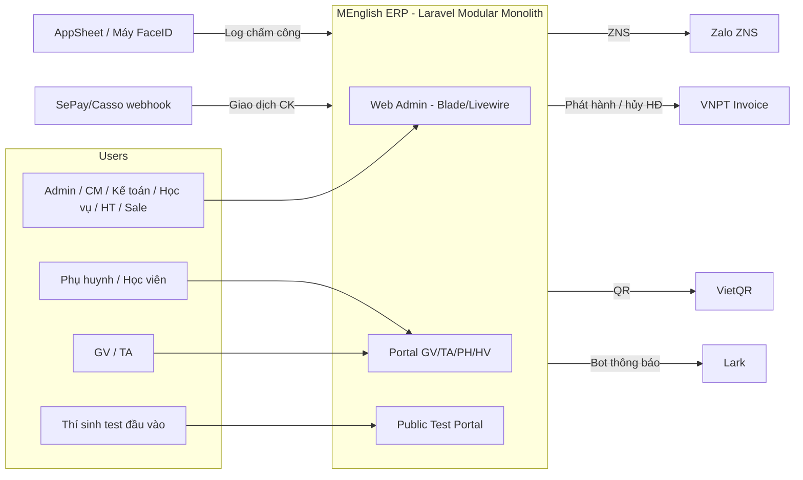

### 4.2 Sơ đồ container (C4 — Level 2)

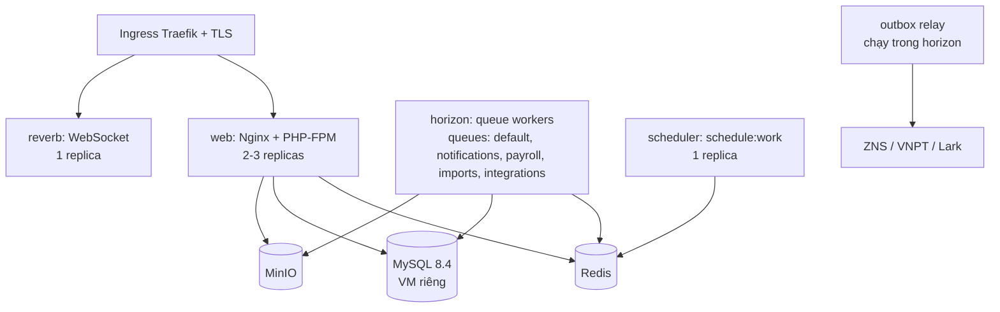

Tất cả container dùng **chung 1 image**, khác nhau ở `command`: `php-fpm`, `horizon`, `schedule:work`, `reverb:start`.

### 4.3 Kiến trúc bên trong một module (Clean Architecture áp dụng cho Laravel)

```
                ┌───────────────────────────────┐
  HTTP/Livewire │  Presentation (Http, Livewire,│
  Console/Jobs  │  Console, Listeners)          │
                └──────────────┬────────────────┘
                               ▼
                ┌───────────────────────────────┐
                │ Application (Actions/UseCases,│  ← DTO vào/ra
                │ Queries, Policies)            │
                └──────────────┬────────────────┘
                               ▼
                ┌───────────────────────────────┐
                │ Domain (Entities, ValueObjects│  ← không phụ thuộc Laravel
                │ Enums, States, Events, Rules, │    (trừ Collection)
                │ Repository interfaces)        │
                └──────────────▲────────────────┘
                               │ implements
                ┌──────────────┴────────────────┐
                │ Infrastructure (Eloquent      │
                │ Models, Repositories, Clients)│
                └───────────────────────────────┘
```

**Nguyên tắc thực dụng:** Laravel mạnh ở Eloquent, không nên tách Entity thuần 100% (tốn gấp đôi code với 1 dev). Quy ước:
- **Domain logic thuần** (công thức lương, tính công nợ, chấm điểm test, state machine) nằm trong `Domain/` dạng service/value object **không đụng DB** → unit test nhanh, không cần DB.
- **Eloquent Model** nằm ở `Infrastructure/Models`, chỉ dùng trong module đó.
- **Action** (1 class = 1 use case, method `handle()`) là điểm vào duy nhất của nghiệp vụ ghi. Controller/Livewire chỉ gọi Action.
- **Query** class cho màn hình đọc phức tạp (list + filter + phân trang), dùng Query Builder tối ưu, trả về DTO/ViewModel.

---

## 5. Cấu trúc module & quy tắc code

### 5.1 Cây thư mục

```
menglish-erp/
├── app/
│   ├── Modules/
│   │   ├── Identity/          # user, role, permission, override, session lock
│   │   ├── Organization/      # branch, room, category, holiday, bank account, sequence
│   │   ├── Hr/                # hồ sơ nhân sự, hợp đồng, kiêm nhiệm
│   │   ├── Crm/               # lead, pipeline, history, import, care, closing wizard
│   │   ├── Assessment/        # đề test, câu hỏi, thang điểm, bài làm, portal test
│   │   ├── Academic/          # level, course, class, schedule, session, student, guardian,
│   │   │                      # enrollment, attendance, make-up
│   │   ├── Curriculum/        # syllabus, chặng, buổi, tài liệu, giao chặng, big test, ôn thi
│   │   ├── Finance/           # tuition ledger, receipt, invoice, refund, reminder, expense
│   │   ├── Timekeeping/       # timesheet, sync log, rate card
│   │   ├── Payroll/           # period, payslip, commission, KPI
│   │   ├── Discipline/        # vi phạm, giải trình, chốt phạt
│   │   ├── Operations/        # work task, TA task, class report
│   │   ├── Inventory/         # sách, nhập/xuất, tồn, đối chiếu
│   │   ├── Support/           # helpdesk ticket
│   │   ├── Notification/      # in-app, ZNS, Lark, email, template, outbox relay
│   │   ├── Reporting/         # dashboard, read model, báo cáo
│   │   └── Portal/            # presentation cho GV/TA/PH/HV (chỉ gọi Contract)
│   └── Shared/
│       ├── Domain/            # Money, Percentage, DateRange, Phone, Code VO, AggregateRoot
│       ├── Infrastructure/    # BaseRepository, Outbox, SequenceGenerator, MinIO, Audit
│       └── Http/              # middleware (EnsureAccountIsActive, BranchScope, RequestId)
├── resources/views/
│   ├── components/ui/         # design system
│   ├── layouts/               # app shell (sidebar theo quyền)
│   └── modules/<module>/...   # (hoặc đặt trong từng module qua loadViewsFrom)
├── database/                  # migration dùng chung (sessions, jobs, cache)
├── docker/                    # Dockerfile multi-stage, nginx.conf, php.ini
├── deploy/helm/menglish-erp/  # Helm chart
├── docs/                      # tài liệu thiết kế, ADR, sprint log
└── tests/Architecture/        # arch test toàn cục
```

### 5.2 Cấu trúc bên trong 1 module (ví dụ `Finance`)

```
app/Modules/Finance/
├── Contracts/                         # PUBLIC API cho module khác dùng
│   ├── TuitionServiceContract.php     # openAccount(), postCharge(), balanceOf()
│   └── Dto/OpenTuitionAccountData.php
├── Domain/
│   ├── Entities/ TuitionAccount.php (logic thuần)
│   ├── ValueObjects/ ReceiptNumber.php, InvoiceNumber.php
│   ├── Enums/ PaymentMethod.php, TuitionStatus.php
│   ├── States/Receipt/ Draft.php, Pending.php, Approved.php, Rejected.php, Voided.php
│   ├── Services/ DebtCalculator.php, RefundCalculator.php
│   ├── Events/ ReceiptApproved.php, InvoiceCancelled.php
│   ├── Exceptions/
│   └── Repositories/ TuitionAccountRepository.php (interface)
├── Application/
│   ├── Actions/ CreateReceiptDraft.php, SubmitReceipt.php, ApproveReceipt.php, ...
│   ├── Queries/ OverdueTuitionQuery.php, ReceiptQueueQuery.php
│   ├── Dto/
│   └── Policies/ ReceiptPolicy.php
├── Infrastructure/
│   ├── Models/ (Eloquent)
│   ├── Repositories/ EloquentTuitionAccountRepository.php
│   ├── Clients/ VnptInvoiceClient.php
│   └── Listeners/ (lắng nghe event từ module khác)
├── Http/
│   ├── Controllers/  Requests/  Resources/
│   └── Livewire/ ReceiptApprovalQueue.php ...
├── Console/ SendDebtReminders.php
├── Database/ migrations/ factories/ seeders/
├── Resources/views/
├── routes/ web.php
├── Tests/ Unit/ Feature/
└── FinanceServiceProvider.php         # bind Contract → implementation, đăng ký route/view/migration
```

### 5.3 Quy tắc bắt buộc (enforce bằng CI)

| Quy tắc | Công cụ |
|---|---|
| Module A **chỉ** được `use App\Modules\B\Contracts\*` hoặc lắng nghe `App\Modules\B\Domain\Events\*` | Deptrac + Pest `arch()` |
| `Domain/` không import `Illuminate\Database\*`, `Illuminate\Http\*` | Pest `arch()` |
| Không FK vật lý xuyên module ở các cặp module "có thể tách" (Finance ↔ Crm, Payroll ↔ Crm…). Chỉ lưu ID + index. FK vật lý **trong** module thì bắt buộc. | Review + migration lint |
| Mọi thao tác ghi đi qua Action, bọc `DB::transaction()` | Review |
| Không query trong vòng lặp (N+1): bật `Model::preventLazyLoading()` ở local/testing, `preventSilentlyDiscardingAttributes()`, `preventAccessingMissingAttributes()` | Laravel strict mode |
| Tiền là `Money`, không `float` | Larastan rule tự viết |
| Mã chứng từ (KH-, HV-, PT-, BB-, PR-, TK-, HĐ) sinh qua `SequenceGenerator` (row lock) | Unit test |
| Commit message tiếng Anh, ngắn gọn (`feat(finance): approve receipt flow`) | commitlint |

### 5.4 Giao tiếp giữa module

| Kiểu | Khi nào dùng | Ví dụ |
|---|---|---|
| **Sync qua Contract** (trong cùng transaction) | Cần kết quả ngay / cần ACID | Closing Wizard gọi `AcademicContract::enroll()` và `TuitionServiceContract::openAccount()` |
| **Domain Event nội bộ** (`ShouldDispatchAfterCommit`) | Phản ứng phụ, cho phép eventual consistency | `ReceiptApproved` → Crm cập nhật doanh số sale, Reporting cập nhật read model |
| **Outbox → Queue** | Gọi hệ thống ngoài | `BigTestResultApproved` → gửi ZNS phụ huynh |

---

## 6. Thiết kế từng module (Bounded Context)

> Quy ước bảng: `PK` khóa chính (BIGINT UNSIGNED auto-increment), `UK` unique, `FK` khóa ngoại vật lý, `ref` chỉ lưu ID (không FK vật lý, xuyên module), `N` nullable. Mọi bảng có `created_at`, `updated_at`; bảng nghiệp vụ chính có `deleted_at` (soft delete) và `created_by`, `updated_by`.

### 6.1 Nền tảng: `Identity`, `Organization`, `Hr`, `Audit`

**Bảng chính:**

| Bảng | Cột quan trọng | Index |
|---|---|---|
| `users` | `employee_code` UK N, `name`, `email` UK, `phone` N, `password`, `primary_branch_id` FK, `is_active`, `locked_at` N, `last_login_at`, `lark_user_id` N | `(is_active, primary_branch_id)` |
| `roles`, `permissions`, `model_has_roles`, `role_has_permissions` | Spatie. Permission format `module.action` | Spatie mặc định |
| `user_branch_access` | `user_id`, `branch_id` | UK `(user_id, branch_id)`. Nhân sự làm nhiều cơ sở |
| `user_permission_overrides` | `user_id`, `permission`, `effect` ENUM(`allow`,`deny`), `scope_type` ENUM(`all`,`branch`,`class`), `scope_id` N, `created_by` | UK `(user_id, permission, scope_type, scope_id)` |
| `branches` | `code` UK, `name`, `address`, `is_active` | |
| `rooms` | `branch_id` FK, `code`, `name`, `capacity`, `is_active` | UK `(branch_id, code)` |
| `system_categories` | `type` (`lead_source`, `lost_reason`, `position`, `violation_type`, `allowance_type`…), `code`, `name`, `sort_order`, `is_active` | UK `(type, code)`, `(type, is_active, sort_order)` |
| `holidays` | `code` UK, `name`, `start_date`, `end_date`, `scope` ENUM(`system`,`branch`) | `(start_date, end_date)` |
| `holiday_branches` | `holiday_id` FK, `branch_id` FK | PK kép |
| `sequences` | `key` (VD `PT:2026`, `KH`), `current_value` | UK `(key)`. Dùng `SELECT … FOR UPDATE` |
| `employee_profiles` (Hr) | `user_id` UK, `employment_type` ENUM(`fulltime_teacher`,`parttime_teacher`,`foreign_teacher`,`assistant`,`academic_head`,`academic_staff`,`sales`,`office`), `rank_id` N, `national_id` (mã hóa), `dob`, `hometown`, `address`, `emergency_contact`, `education`, `certificates` JSON, `teaching_levels` JSON, `bank_account_no` (mã hóa), `bank_name`, `insurance_salary`, `dependents_count` | `(employment_type)` |
| `employment_contracts` (Hr) | `user_id` FK, `type`, `base_salary`, `start_date`, `end_date` N, `status`, `file_path` | `(user_id, start_date)`, `(end_date, status)` → job cảnh báo sắp hết hạn |
| `activity_log` (Audit) | Spatie + `ip`, `user_agent`, `request_id`, `branch_id` | `(log_name, created_at)`, `(subject_type, subject_id)`, `(causer_id, created_at)`. **Partition RANGE theo tháng** |

**Điểm thiết kế đáng chú ý:**
- **Permission Resolver** (`Identity\Domain\Services\PermissionResolver`): ưu tiên `override scoped (class/branch)` > `override all` > `role permission`. **Deny thắng allow** khi cùng cấp. Kết quả cache Redis theo key `perm:{user_id}:{version}`. Khi override hoặc role đổi thì tăng `version`, không phải xóa cache hàng loạt.
- **Khóa tài khoản tức thì**: middleware `EnsureAccountIsActive` đọc cờ `user:locked:{id}` trên Redis (O(1)) thay vì query DB mỗi request. Khi khóa thì set cờ và xóa toàn bộ session của user.
- **"Hoàn tác" trong Nhật ký vận hành**: chỉ hỗ trợ cho thay đổi thuộc tính đơn giản (update 1 bản ghi, không kéo side effect). Thao tác có side effect (duyệt phiếu, chốt lương) không có nút hoàn tác, UI ẩn nút.
- **Data scope chi nhánh**: global scope `BranchScoped` áp cho model có `branch_id`, lấy danh sách chi nhánh từ `user_branch_access`. Admin bypass.

---

### 6.2 ⭐ `Crm` — Tuyển sinh & Phễu bán hàng

#### 6.2.1 Stage machine

Mockup dùng 8 giai đoạn + Thất bại. Schema cũ có 6. Đề xuất chuẩn hóa như sau (BA cần chốt, xem Q1):

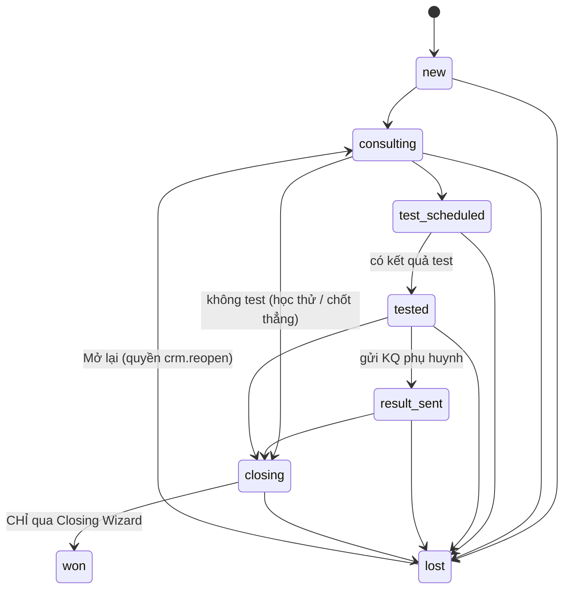

**Quy tắc:**
- Chỉ đi tiến. Lùi stage cần quyền `crm.stage_rollback`, bắt buộc nhập lý do, và ghi history `stage_change`.
- `won` chỉ đạt được qua `CloseDealAction` (Closing Wizard). Kéo thả Kanban vào cột Won bị chặn.
- `lost` bắt buộc có `lost_reason_id` (danh mục) + `lost_note` (log chi tiết, mockup "Khách không chốt"). Xử lý Gap #6.
- Mỗi lần đổi stage, hệ thống tự tính `next_contact_at` theo `crm_stage_sla` (VD: new → gọi trong 2h, consulting → 24h). Thẻ Kanban hiển thị "Quá hạn / Sắp hết hạn / Còn hạn".

#### 6.2.2 Bảng dữ liệu

| Bảng | Cột quan trọng | Index |
|---|---|---|
| `crm_leads` | `code` UK (KH-00001), `full_name`, `phone` (chuẩn hóa `0xxxxxxxxx`), `parent_name` N, `parent_phone` N, `dob` N, `email` N, `school` N, `branch_id` ref, `source_id` ref(category), `course_interest_id` ref N, `assigned_user_id` ref, `stage` VARCHAR(20), `priority` TINYINT, `next_contact_at` N, `last_interaction_at` N, `deal_value` BIGINT, `deposit_amount` BIGINT, `lost_reason_id` N, `lost_note` TEXT N, `won_at` N, `lost_at` N, `student_id` ref N, `placement_level` N | UK `code`; `(assigned_user_id, stage, next_contact_at)` cho Kanban của sale; `(branch_id, stage, next_contact_at)` cho Kanban CM; `(phone)`; `(parent_phone)`; `(source_id, created_at)` cho báo cáo; `(stage, won_at)`; FULLTEXT `(full_name, parent_name)` WITH PARSER ngram |
| `crm_lead_activities` | `lead_id` FK, `user_id` ref N, `type` ENUM(`system`,`call`,`message`,`meet`,`note`,`stage_change`,`test`,`trial`,`care`), `from_stage` N, `to_stage` N, `content` TEXT, `occurred_at` | `(lead_id, occurred_at DESC)` |
| `crm_stage_sla` | `stage` UK, `next_contact_hours` | |
| `crm_appointments` | `lead_id` FK, `kind` ENUM(`placement_test`,`trial_class`,`consultation`), `mode` ENUM(`online`,`offline`), `scheduled_at`, `branch_id` ref, `room_id` ref N, `examiner_id` ref N, `class_session_id` ref N (học thử gắn buổi học thật), `status` ENUM(`scheduled`,`done`,`no_show`,`cancelled`), `feedback` TEXT N, `result_sent_at` N | `(scheduled_at, branch_id)`, `(examiner_id, scheduled_at)`, `(lead_id)` |
| `crm_sales_credits` | `sale_user_id` ref, `lead_id` FK, `student_id` ref, `kind` ENUM(`new`,`renewal`), `amount` BIGINT, `student_count` TINYINT DEFAULT 1, `credited_at`, `reversed_at` N | `(sale_user_id, credited_at)`. **Nguồn dữ liệu hoa hồng cho Payroll** |
| `crm_care_tasks` | `student_id` ref, `lead_id` FK N, `milestone` ENUM(`welcome`,`after_5_sessions`,`mid_month`,`end_month`,`birthday`,`custom`), `due_date`, `assignee_id` ref, `done_at` N, `note` | `(assignee_id, done_at, due_date)`, `(due_date)` |
| `crm_imports` | `branch_id`, `file_path`, `status` ENUM(`uploaded`,`validated`,`committed`,`expired`), `total/valid/warning/error_rows`, `expires_at` (30 phút), `committed_by` | `(created_by, created_at)` |
| `crm_import_rows` | `import_id` FK, `row_no`, `payload` JSON, `status`, `errors` JSON | `(import_id, status)` |

#### 6.2.3 Use case (Action)

| Action | Mô tả | Ghi chú kỹ thuật |
|---|---|---|
| `CreateLead` | Tạo lead, sinh mã KH-, ghi activity `system`, set SLA | Cảnh báo (không chặn) nếu trùng SĐT trong 90 ngày. Trả về danh sách lead trùng để sale quyết |
| `UpdateLead` | Sửa thông tin | Không đổi chi nhánh nếu đã có lớp (mockup "Sửa thông tin khách") |
| `ReassignLead` | Phân công lại | Quyền `crm.assign` |
| `MoveLeadStage` | Đổi stage (Kanban) | Validate transition, `lost` bắt buộc lý do |
| `LogInteraction` | Ghi gọi/nhắn/gặp | Cập nhật `last_interaction_at`, tính lại `next_contact_at` |
| `ScheduleAppointment` | Hẹn test / học thử | Kiểm tra trùng lịch người chấm (qua `ScheduleContract`) |
| `ImportLeads` (2 bước) | Upload → validate/preview → commit | Stream đọc Excel bằng openspout, chạy job queue `imports`. Loại trùng SĐT trong file và với DB. Kiểm tra nguồn có trong danh mục. Xuất file lỗi |
| `CloseDeal` | **Closing Wizard**, xem mục 8.1 | 1 transaction xuyên module |
| `ScanStaleLeads` | Scheduler 15 phút/lần, **không** chạy khi admin mở trang như bản cũ | Lead có `next_contact_at < now()` và chưa báo thì phát notification `stale_lead` (in-app + Lark) |

#### 6.2.4 Màn hình → Query

| Màn hình | Query class | Tối ưu |
|---|---|---|
| Pipeline Kanban | `PipelineBoardQuery` | 1 query `GROUP BY stage` để đếm + 1 query lấy top N card mỗi cột (window function `ROW_NUMBER() OVER (PARTITION BY stage ORDER BY next_contact_at)`), eager load `assignee:id,name`. Không N+1 |
| Danh sách khách | `LeadListQuery` | Cursor/offset pagination, filter theo index, `LIKE 'phone%'` với SĐT, FULLTEXT với tên |
| Báo cáo doanh số (funnel) | `SalesFunnelQuery` | Đọc từ `crm_lead_activities` loại `stage_change` trong khoảng ngày (funnel theo lượt qua stage, không theo stage hiện tại) |
| Khách không chốt | `LostLeadQuery` | Index `(stage, lost_at)` |
| Khách chốt thành công / Chờ xếp lớp | `WonLeadQuery` | Join sang `Academic` qua Contract `StudentLookupContract::statusesFor(ids)` (batch, 1 query) |

---

### 6.3 `Assessment` — Test đầu vào (thuộc phễu CRM)

Mockup dùng **thang Cambridge YLE theo khối lớp** (Khối 1-2: Nghe /10, Đọc-Viết /15, Nói /10…), khác bản schema cũ dùng 4 kỹ năng CEFR. Thiết kế cần **thang điểm cấu hình được** để phủ cả Kids (YLE) và IELTS/Adults (CEFR/band).

| Bảng | Cột quan trọng | Index |
|---|---|---|
| `assessment_scoring_schemes` | `code` UK (VD `YLE-K1-2`), `name`, `grade_group`, `sections` JSON (`[{key:"L",label:"Nghe",max:10},…]`), `total_max`, `is_active` | |
| `assessment_score_bands` | `scheme_id` FK, `section_key`, `min_score`, `max_score`, `comment_template` TEXT | `(scheme_id, section_key, min_score)` |
| `assessment_placement_rules` | `scheme_id` FK, `min_total`, `max_total`, `recommended_level_id` ref, `recommended_label` | `(scheme_id, min_total)` |
| `assessment_tests` | `code` UK, `title`, `grade_group`, `scheme_id` FK, `duration_minutes`, `status` ENUM(`draft`,`active`,`hidden`), `is_preset` (khóa sửa, chỉ duplicate) | `(grade_group, status)` |
| `assessment_questions` | `test_id` FK, `order`, `section_key`, `type` ENUM(`mcq`,`fill_blank`,`writing`,`speaking`), `content`, `media_path` N (mp3/ảnh), `options` JSON N, `answer_key` JSON N, `points` DECIMAL(4,2), `grading_note` | `(test_id, order)` |
| `assessment_invitations` | `test_id` FK, `lead_id` ref, `token` UK (ULID), `sent_at`, `expires_at`, `status` | UK `token` |
| `assessment_submissions` | `invitation_id` FK N, `test_id` FK, `lead_id` ref N, `candidate_name`, `candidate_phone`, `started_at`, `submitted_at`, `section_scores` JSON, `total_score`, `recommended_level_id` N, `comments` JSON, `status` ENUM(`in_progress`,`submitted`,`auto_graded`,`graded`,`sent`), `graded_by` N | `(lead_id)`, `(candidate_phone)`, `(status, submitted_at)` |
| `assessment_answers` | `submission_id` FK, `question_id` FK, `answer` JSON, `auto_score` N, `manual_score` N, `audio_path` N | UK `(submission_id, question_id)` |

**Luồng:** Sale chọn khối lớp → chọn đề → `SendTestLink` (ZNS/SMS/copy link) → thí sinh làm trên `/t/{token}` (không cần đăng nhập, rate limit theo IP + token) → auto chấm MCQ/fill → GV chấm Writing/Speaking → `ScoringService` tính tổng, tra `score_bands` sinh nhận xét, tra `placement_rules` gợi ý lớp → phát event `PlacementTestGraded` → `Crm` cập nhật lead sang `tested`, ghi activity.

**Chống gian lận nhẹ:** token dùng 1 lần, khóa khi hết `duration_minutes` + 5 phút grace, autosave mỗi 20 giây (Livewire), lưu `started_at` phía server.

---

### 6.4 ⭐ `Academic` — Lịch (TKB, buổi học, điểm danh, bổ trợ)

#### 6.4.1 Mô hình lịch

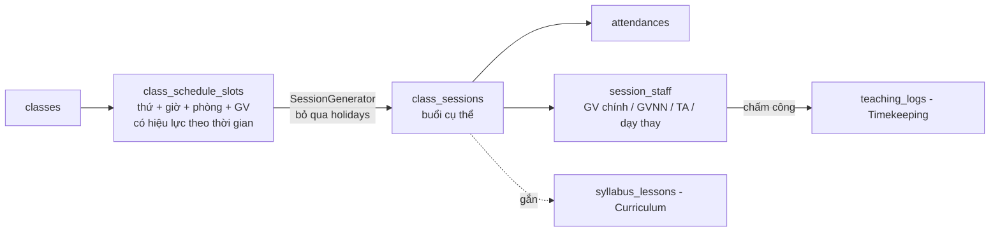

- **Slot** là mẫu lặp theo tuần. Mockup TKB có 2 slot, thiết kế cho phép N slot.
- **Session** là buổi học cụ thể, được `SessionGenerator` sinh từ slot, **tự bỏ qua ngày nghỉ** (holiday toàn hệ thống + chi nhánh) và dời buổi để đủ `planned_sessions`.
- Đổi TKB chỉ **sinh lại các buổi tương lai chưa diễn ra**. Buổi đã điểm danh/chấm công thì bất biến.
- **Buổi bù/bổ trợ/học thêm** là session với `type` khác `regular`.
- Mỗi session gắn 1 `syllabus_lesson_id` theo chặng đang active. Đây là cầu nối Lịch ↔ Syllabus.

#### 6.4.2 Bảng dữ liệu

| Bảng | Cột quan trọng | Index |
|---|---|---|
| `course_levels` | `code` UK (KID-BEG-01), `name`, `group` ENUM(`kids`,`teens`,`ielts`,`adults`), `sort_order`, `is_active` | Không cho xóa khi có lớp tham chiếu, chỉ cho ngừng hoạt động (mockup) |
| `courses` | `code` UK, `name`, `level_id` FK, `list_price` BIGINT, `planned_sessions`, `session_minutes`, `is_active` | `(level_id, is_active)` |
| `classes` | `code` UK, `name`, `course_id` FK, `branch_id` ref, `academic_year`, `status` ENUM(`planned`,`enrolling`,`active`,`completed`,`cancelled`), `min_to_open` (ngưỡng khai giảng 6–8), `max_capacity`, `start_date`, `end_date` N, `default_room_id` ref, `main_teacher_id` ref, `foreign_teacher_id` ref N, `assistant_id` ref N, `active_enrollment_count` (cache) | `(branch_id, status)`, `(main_teacher_id, status)`, `(course_id, status)` |
| `class_schedule_slots` | `class_id` FK, `weekday` TINYINT(1–7), `start_time`, `end_time`, `room_id` ref, `teacher_id` ref, `foreign_teacher_id` N, `assistant_id` N, `effective_from`, `effective_to` N | `(class_id, effective_from)` |
| `class_sessions` | `class_id` FK, `branch_id` (denormalize để lọc), `session_no`, `type` ENUM(`regular`,`makeup`,`extra`,`trial`,`exam`), `starts_at`, `ends_at`, `room_id` ref, `syllabus_lesson_id` ref N, `status` ENUM(`scheduled`,`done`,`cancelled`,`postponed`), `cancel_reason` N, `attendance_closed_at` N | `(class_id, starts_at)`, `(branch_id, starts_at)` cho Dashboard ngày/tuần, `(room_id, starts_at, ends_at)` check trùng phòng |
| `session_staff` | `session_id` FK, `user_id` ref, `role` ENUM(`main`,`foreign`,`assistant`,`substitute`), `substitute_for_id` N | UK `(session_id, user_id)`, **`(user_id, starts_at, ends_at)`** (denormalize từ session) để check trùng lịch và xem lịch cá nhân |
| `students` | `code` UK (HV-00001), `full_name`, `dob`, `phone` N, `email` N, `school` N, `address` N, `note` N, `branch_id` ref, `status` ENUM(`waiting_class`,`trial`,`studying`,`deferred`,`summer_break`,`completed`,`dropped`), `lead_id` ref N, `user_id` ref N (tài khoản portal) | `(branch_id, status)`, `(phone)`, FULLTEXT `full_name` |
| `guardians` | `full_name`, `phone` UK, `zalo_uid` N, `user_id` ref N | UK `phone` |
| `student_guardians` | `student_id` FK, `guardian_id` FK, `relation`, `is_primary` | PK kép |
| `enrollments` | `student_id` FK, `class_id` FK, `status` ENUM(`trial`,`pending_confirm`,`active`,`deferred`,`transferred`,`completed`,`dropped`), `joined_at`, `left_at` N, `lead_id` ref N, `confirmed_by` N, `confirmed_at` N, `curriculum_delivered`, `zalo_group_added` | `(class_id, status)`, `(student_id, status)`. Rule: 1 học viên chỉ có 1 enrollment `active` trong 1 lớp, dùng generated column `active_key = IF(status='active', CONCAT(student_id,'-',class_id), NULL)` + UNIQUE |
| `attendances` | `session_id` FK, `student_id` FK, `status` ENUM(`present`,`late`,`excused`,`absent`), `note` N, `marked_by`, `marked_at`, `source` ENUM(`teacher`,`staff_backup`) | UK `(session_id, student_id)`, `(student_id, session_id)` |
| `makeup_plans` | `student_id` FK, `missed_session_id` FK N, `reason` ENUM(`absent`,`weak`,`low_score`), `source_ref` (class report / big test result), `makeup_session_id` FK N, `assignee_id` ref, `status` ENUM(`open`,`scheduled`,`done`,`cancelled`) | `(status, assignee_id)`, `(student_id)` |

#### 6.4.3 Quy tắc & thuật toán

| Quy tắc | Cài đặt |
|---|---|
| **Phát hiện xung đột** GV/TA/phòng (mockup TKB "Cảnh báo xung đột lịch") | `ScheduleConflictDetector`: query khoảng chồng lấn `starts_at < :end AND ends_at > :start` trên `session_staff (user_id, starts_at, ends_at)` và `class_sessions (room_id, …)`. Chạy khi lưu slot (dry-run sinh buổi 8 tuần tới) và khi thêm buổi lẻ. Trả danh sách xung đột, chặn lưu nếu không có quyền `schedule.force` |
| Sinh buổi | `SessionGenerator` (domain service thuần, unit test kỹ): input = slots + holidays + `planned_sessions` + `start_date`, output = danh sách session. Tính `end_date` dự kiến của lớp |
| Ngày nghỉ | Tạo/sửa holiday thì phát event `HolidayChanged`, job tính lại các buổi tương lai bị ảnh hưởng, gửi thông báo cho GV/TA/Học vụ |
| Điểm danh | GV chính điểm danh. Học vụ/CM điểm danh dự phòng (`source=staff_backup`, BPMN bước 10). Khóa sau `attendance_closed_at` (mặc định 24h sau buổi). Mở lại cần quyền |
| Đối soát điểm danh (10b) | Query "buổi đã kết thúc mà chưa điểm danh" cho Dashboard lớp |
| Vắng → bổ trợ | Vắng `absent` phát `StudentAbsent`, tạo `makeup_plans` (BPMN 11). TA/Học vụ xếp buổi bù (11b) |
| Ngưỡng khai giảng | Lớp `enrolling` hiển thị "Cần thêm N học viên" (`min_to_open - active_enrollment_count`). Chỉ chuyển `active` khi đủ ngưỡng hoặc có quyền override |
| Sĩ số | Closing Wizard/Chuyển lớp: `SELECT … FOR UPDATE` trên dòng `classes` rồi kiểm `active_enrollment_count < max_capacity` để tránh vượt sĩ số khi 2 sale chốt cùng lúc |

#### 6.4.4 Màn hình lịch

| Màn hình | Query | Ghi chú |
|---|---|---|
| Dashboard lớp theo ngày | `DailyClassBoardQuery(branch, date)` | 1 query sessions + eager `staff.user`, `room`, subquery đếm attendance. Có nút "Chấm công" (chỉ trong 24h sau giờ học) |
| Ma trận khung giờ tuần | `WeeklyMatrixQuery(branch, week)` | Pivot phòng × khung giờ |
| Lịch dạy của tôi (GV/TA portal) | `MyScheduleQuery(user, range)` | Dùng index `session_staff(user_id, starts_at)` |
| TKB lớp + báo cáo phòng/nhân sự | `RoomUtilizationQuery` | Tỷ lệ sử dụng phòng, số ca/nhân sự theo ngày (thay `hr_daily_demands` của bản cũ, tính động) |
| Hồ sơ học viên → Lộ trình buổi học | `StudentJourneyQuery` | Session + lesson + attendance |

---

### 6.5 ⭐ `Curriculum` — Syllabus, Chặng, Tài liệu, Big Test

#### 6.5.1 Mô hình

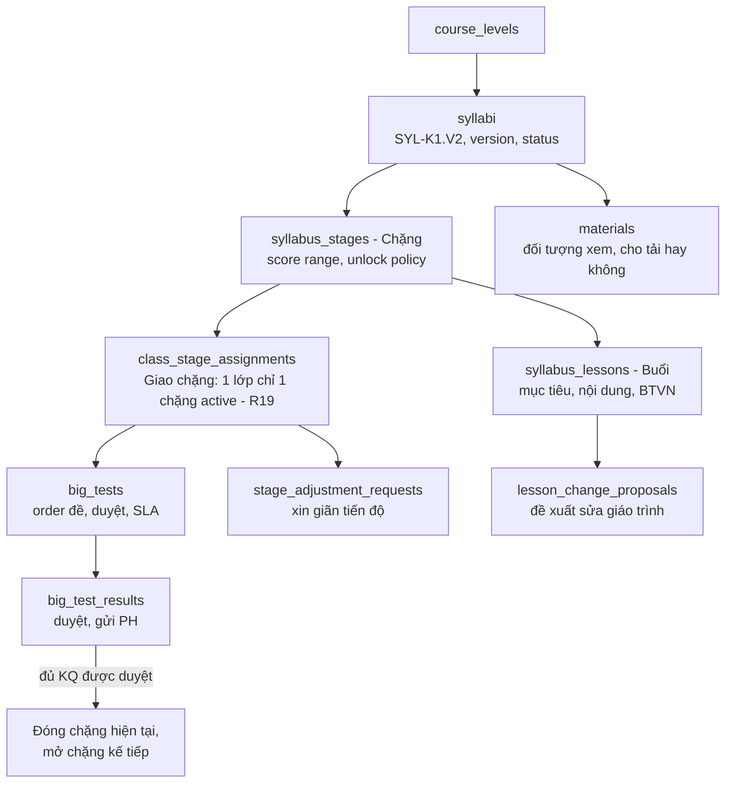

#### 6.5.2 Bảng dữ liệu

| Bảng | Cột quan trọng | Index |
|---|---|---|
| `syllabi` | `code` UK, `level_id` ref, `title`, `version`, `status` ENUM(`draft`,`active`,`archived`), `activated_at` | `(level_id, status)`. Rule: 1 level có tối đa 1 syllabus `active`, dùng generated column + UNIQUE |
| `syllabus_stages` | `syllabus_id` FK, `order`, `name`, `score_from` N, `score_to` N, `unlock_policy` ENUM(`weekly`,`after_test`,`manual`), `overview_link` N, `planned_sessions` | UK `(syllabus_id, order)` |
| `syllabus_lessons` | `stage_id` FK, `lesson_no`, `title`, `objectives` TEXT, `content` MEDIUMTEXT (HTML đã sanitize), `homework` TEXT, `attachments` JSON | UK `(stage_id, lesson_no)` |
| `syllabus_authoring_tasks` | `syllabus_id` FK, `stage_id` N, `lesson_from`, `lesson_to`, `assignee_id` ref, `due_date`, `progress` TINYINT, `status` ENUM(`in_progress`,`submitted`,`approved`,`overdue`) | `(assignee_id, status)`, `(due_date, status)` |
| `lesson_change_proposals` | `lesson_id` FK, `field`, `old_value`, `new_value`, `reason`, `proposed_by`, `reviewer_id` N, `status` ENUM(`pending`,`approved`,`rejected`), `review_note` | `(status, created_at)` |
| `materials` | `syllabus_id` FK, `stage_id` N, `title`, `file_path`, `mime`, `size`, `pdf_preview_path` N, `downloadable` BOOL, `status` | `(syllabus_id, stage_id)` |
| `material_audiences` | `material_id` FK, `role` | PK kép. Mockup "Chọn đối tượng xem: Admin/Học vụ/Học thuật/Giáo viên" |
| `class_stage_assignments` | `class_id` ref, `stage_id` FK, `teacher_id` ref, `start_date`, `status` ENUM(`active`,`closed`), `closed_at` N, `extra_sessions` SMALLINT DEFAULT 0, `active_class_key` (generated: `IF(status='active', class_id, NULL)`) | **UK `active_class_key`** để enforce R19 ở tầng DB; `(teacher_id, status)` |
| `stage_adjustment_requests` | `assignment_id` FK, `requested_by`, `extra_sessions`, `reason`, `status`, `reviewer_id` N, `due_at` (SLA duyệt), `reviewed_at` | `(status, due_at)` |
| `big_tests` | `code` UK (BT-2026-001), `assignment_id` FK, `class_id` ref, `type` ENUM(`stage`,`midterm`,`final`), `scheduled_at`, `room_id` ref N, `proctor_id` ref N, `teacher_request_note`, `status` ENUM(`ordered`,`paper_approved`,`distributed`,`conducted`,`grading`,`results_review`,`published`), `paper_due_at` (SLA), `ordered_at` | `(status, scheduled_at)` cho màn "Nhắc lịch Big Test 7 ngày", `(class_id)` |
| `big_test_papers` | `big_test_id` FK, `file_path`, `approved_by` N, `approved_at` N | |
| `big_test_results` | `big_test_id` FK, `student_id` ref, `part_scores` JSON, `total_score` DECIMAL(4,1), `video_link` N, `teacher_comment`, `status` ENUM(`draft`,`submitted`,`approved`,`sent`), `approved_by` N, `sent_at` N | UK `(big_test_id, student_id)`, `(status)` |
| `term_review_plans` (B21) | `class_id` ref, `school_term`, `outline_path`, `status` | Phase 1 tối giản |
| `term_review_scores` | `plan_id` FK, `student_id` ref, `kind` ENUM(`pre_test`,`mock_test`), `score` | Điểm < 7 phát event `LowTermScore`, Academic tạo `makeup_plans` (nối Bước 11) |

#### 6.5.3 Quy tắc nghiệp vụ

| Rule | Cài đặt |
|---|---|
| **R19**: 1 lớp chỉ có 1 chặng active | UNIQUE trên generated column + `AssignStage` Action kiểm tra trước để trả lỗi thân thiện |
| Big Test KQ được duyệt thì **tự đóng chặng và mở chặng kế tiếp** | Listener `OnBigTestPublished`: nếu `type=stage` và mọi `big_test_results` của lớp đã `approved/sent` thì đóng assignment, tạo assignment chặng `order+1` (nếu có), phát `StageAdvanced`. `Academic` gắn `syllabus_lesson_id` cho các session tương lai |
| Duyệt đề Big Test có SLA | `paper_due_at = scheduled_at - N ngày` (cấu hình). Scheduler hằng ngày gửi nhắc cho HT (in-app + Lark). Mockup "Cảnh báo SLA" |
| Xin giãn tiến độ được duyệt | `ScheduleContract::appendExtraSessions(class_id, n)` sinh thêm buổi, đẩy lịch Big Test tương ứng |
| Duyệt & gửi phụ huynh | `ApproveBigTestResult` → outbox `zns.big_test_result` (template ZNS gồm điểm, nhận xét, link video) → ghi `sent_at` |
| Tài liệu chỉ xem online | Upload DOCX/PPTX thì job convert sang PDF qua **Gotenberg** (container LibreOffice), lưu `pdf_preview_path`. Viewer dùng PDF.js, file stream qua controller kiểm quyền (không lộ URL MinIO), **watermark** tên + SĐT người xem, TTL ngắn. `downloadable=false` thì không có endpoint tải |
| Version syllabus | Kích hoạt version mới không ảnh hưởng lớp đang học. Lớp giữ `syllabus_id` tại thời điểm giao chặng đầu tiên |

---

### 6.6 ⭐ `Timekeeping` — Chấm công giảng dạy

| Bảng | Cột quan trọng | Index |
|---|---|---|
| `teaching_logs` | `session_id` ref, `user_id` ref, `role` (main/foreign/assistant/substitute), `work_date`, `check_in_at` N, `check_out_at` N, `minutes`, `source` ENUM(`faceid`,`appsheet`,`self`,`manual`), `status` ENUM(`valid`,`missing_in`,`missing_out`,`pending_review`,`invalid`), `adjust_reason` N, `adjusted_by` N, `payroll_period_id` N (khi đã chốt) | UK `(session_id, user_id)`, `(user_id, work_date)`, `(work_date, status)` |
| `timesheet_sync_runs` | `source`, `branch_id` N, `started_at`, `finished_at`, `total_rows`, `success_rows`, `error_rows`, `skipped_rows`, `status` ENUM(`success`,`partial`,`failed`), `error_message` | `(started_at)` |
| `timesheet_sync_errors` | `run_id` FK, `employee_code`, `error_code` (DATA_MISMATCH, RECORD_NOT_FOUND, INVALID_FORMAT, API_TIMEOUT), `detail`, `raw` JSON | `(run_id)` |
| `timekeeping_rules` | `missing_light_penalty` (30.000đ), `missing_heavy_threshold`, `self_checkin_window_minutes`, `manual_edit_window_hours` (24h) | 1 dòng cấu hình, có hiệu lực theo thời gian |

**Quy tắc:**
- Session `done` tự sinh `teaching_logs` cho các staff của buổi. Log từ FaceID/AppSheet được **khớp** theo (mã NV, ngày, khung giờ ±30 phút).
- **Kỳ lương đã khóa thì không sửa, không ghi đè khi sync** (mockup "Hệ thống bỏ qua không ghi đè dữ liệu của các nhân sự đã chốt kỳ lương").
- Chấm công thủ công: 1 lần lưu = 1 dòng công, bắt buộc lý do, ghi audit.
- Thiếu vào/ra: mức nhẹ trừ cố định, mức nặng không tính công. Rule đọc từ `timekeeping_rules`.
- Sync AppSheet/FaceID: job định kỳ (15 phút) + nút "Đồng bộ ngay". Adapter pattern `TimesheetSourceContract` (AppSheetSource, FaceIdSource) để đổi nguồn không sửa core.

---

### 6.7 ⭐ `Discipline` — Vi phạm & Trừ lỗi (BPMN 17)

Mockup có vòng đời chi tiết hơn schema cũ:

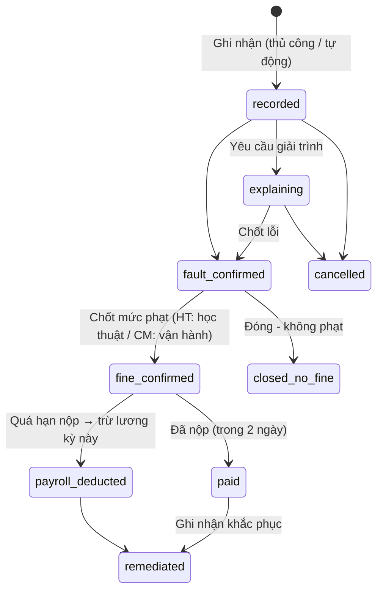

| Bảng | Cột quan trọng | Index |
|---|---|---|
| `violations` | `code` UK (BB-2026-001), `user_id` ref, `reporter_id` ref, `category` ENUM(`academic`,`operational`), `type_id` ref(category `violation_type`), `violation_date`, `class_id` ref N, `session_id` ref N, `source` ENUM(`manual`,`auto`), `amount` BIGINT, `status`, `pay_due_at` N, `paid_at` N, `payslip_id` ref N, `evidence` JSON (file) | `(user_id, status)`, `(status, pay_due_at)`, `(violation_date)` |
| `violation_explanations` | `violation_id` FK, `content`, `attachments`, `submitted_at` | |

**Quy tắc:**
- `category=academic` thì chỉ `academic_head` được chốt phạt. `operational` thì `manager` chốt (BPMN 17b/17c). Enforce bằng Policy.
- **Vi phạm tự động** (source=auto): từ Timekeeping (thiếu chấm công), Academic (chưa điểm danh sau 24h), Curriculum (nộp điểm Big Test trễ). Mỗi nguồn phát event, Discipline tạo `recorded`.
- Không chốt phạt nếu **kỳ lương của nhân viên đã khóa** (mockup cảnh báo).
- Payroll lấy các vi phạm `fine_confirmed` quá `pay_due_at` chưa nộp, chuyển `payroll_deducted` khi payslip được chốt.

---

### 6.8 ⭐ `Payroll` — Tính lương, Hoa hồng, KPI

#### 6.8.1 Nguyên tắc thiết kế

1. **Payslip dạng dòng (line-based)**: mọi khoản cộng/trừ là 1 `payslip_line`. 4 mẫu lương trong mockup (GV part-time, GV full-time, Học thuật, Học vụ) chỉ khác nhau ở **tập calculator**, không khác schema.
2. **Mọi tham số có hiệu lực theo thời gian** (đơn giá, bậc hoa hồng, bậc KPI, tỷ lệ BH). Kỳ lương dùng tham số tại ngày phát sinh.
3. **Snapshot khi chốt**: payslip lưu `inputs_snapshot` JSON. Kỳ đã `approved` thì bất biến (test `updating_commission_tier_does_not_affect_approved_payroll`).
4. **Tính lại idempotent**: xóa các dòng `is_manual=false` rồi sinh lại. Dòng nhập tay giữ nguyên.

#### 6.8.2 Bảng dữ liệu

| Bảng | Cột quan trọng | Index |
|---|---|---|
| `pay_templates` | `code` UK (`parttime_teacher`, `fulltime_teacher`, `academic_head`, `academic_staff`, `assistant`, `sales`, `office`), `calculators` JSON (danh sách calculator theo thứ tự), `settings` JSON | |
| `employee_pay_profiles` | `user_id` UK, `template_code`, `base_salary`, `insurance_salary`, `teaching_mode` ENUM(`per_session`,`percent_revenue`) N, `revenue_percent` N, `effective_from` | `(user_id, effective_from)` |
| `rate_cards` | `user_id` ref N (NULL = mặc định theo loại), `teacher_type` ENUM(`fulltime`,`parttime`,`foreign`,`assistant`), `course_group` N (kids/ielts/communication…), `session_role` N (main/substitute/1on1/grading/workshop), `unit` ENUM(`per_session`,`per_hour`,`per_minute`), `amount` BIGINT, `effective_from`, `effective_to` N, `note` | `(user_id, effective_from)`, `(teacher_type, course_group, effective_from)` |
| `commission_tiers` | `kind` ENUM(`new_sale`,`renewal`), `metric` ENUM(`student_count`,`revenue`), `min_value`, `max_value` N, `rate_percent` DECIMAL(5,2), `fixed_bonus` BIGINT DEFAULT 0, `effective_from`, `effective_to` N | `(kind, effective_from)` |
| `kpi_retention_tiers` | `tier` (A/B/C), `min_retention_rate`, `amount_per_student` (15k/20k/25k), `effective_from` | |
| `allowance_types` | `code`, `name` (ăn trưa, xăng xe, gửi xe, lớp GVNN đan xen, hỗ trợ thỏa thuận…), `taxable` BOOL | |
| `employee_allowances` | `user_id` ref, `allowance_type_id` FK, `amount`, `effective_from`, `effective_to` N | `(user_id, effective_from)` |
| `statutory_rates` | `code` (`bhxh_employee` 10.5%, `union_fee` 0.5%, `pit_family_deduction`, `pit_dependent_deduction`), `value`, `effective_from` | `(code, effective_from)` |
| `payroll_periods` | `code` UK (PR-2026-10), `year`, `month`, `from_date`, `to_date`, `status` ENUM(`open`,`calculating`,`reviewing`,`approved`,`paid`), `locked_at` N, `approved_by` N, `paid_at` N, `total_staff`, `total_net` | **UK `(year, month)`** (Gap #2) |
| `payslips` | `period_id` FK, `user_id` ref, `template_code`, `status` ENUM(`draft`,`kpi_confirmed`,`closed`,`approved`,`paid`), `gross`, `deductions`, `net`, `inputs_snapshot` JSON, `calculated_at`, `closed_by` N | UK `(period_id, user_id)`, `(period_id, status)` |
| `payslip_lines` | `payslip_id` FK, `category` ENUM(`base`,`teaching`,`cover`,`kpi`,`commission`,`renewal_bonus`,`allowance`,`other_bonus`,`penalty`,`insurance`,`union_fee`,`pit`,`other_deduction`), `description`, `quantity` DECIMAL(10,2), `unit_price` BIGINT, `amount` BIGINT (âm = trừ), `source_type` N, `source_id` N, `is_manual`, `created_by` | `(payslip_id, category)`, `(source_type, source_id)` |
| `kpi_confirmations` | `period_id` FK, `user_id` ref, `retained_students`, `tier`, `amount`, `confirmed_by`, `confirmed_at` | UK `(period_id, user_id)` |

#### 6.8.3 Engine tính lương (Strategy + Pipeline)

```php
interface PayCalculator
{
    /** @return list<PayslipLineData> */
    public function calculate(PayContext $ctx): array;
}

// PayContext (readonly): employee, period, payProfile, rates resolver,
// teachingLogs, salesCredits, violations, allowances, statutoryRates
```

| Calculator | Nguồn dữ liệu (qua Contract) | Công thức |
|---|---|---|
| `BaseSalaryCalculator` | `employee_pay_profiles` | Lương cứng, prorate theo ngày công nếu vào/nghỉ giữa kỳ |
| `TeachingCalculator` | `TimekeepingContract::validLogs(user, period)` | Σ(buổi/giờ/phút × `RateResolver`). Resolver: rate riêng user tại ngày dạy → rate theo loại GV + nhóm khóa + vai trò buổi → mặc định hệ thống. 1 dòng/buổi (mockup "Chi tiết buổi dạy") |
| `CoverCalculator` | log `role=substitute` | Dạy thay, dòng riêng |
| `RevenuePercentTeachingCalculator` | Doanh thu lớp (Phase 2 từ Finance; Phase 1 nhập tay) | Mẫu Học thuật "Theo % doanh thu" |
| `KpiRetentionCalculator` | `kpi_confirmations` | Số HS duy trì × đơn giá bậc. **Bắt buộc chốt KPI trước khi chốt kỳ** (mockup chặn chốt nếu còn GV chưa chốt KPI) |
| `CommissionCalculator` | `CrmContract::salesCredits(user, period)` | Đếm HV / doanh thu `new` → tra `commission_tiers` (metric theo cấu hình) |
| `RenewalBonusCalculator` | sales credits `renewal` | Tương tự, `kind=renewal` |
| `AllowanceCalculator` | `employee_allowances` | Cộng các phụ cấp có hiệu lực |
| `PenaltyCalculator` | `DisciplineContract::deductibleFor(user, period)` | Trừ vi phạm `fine_confirmed` quá hạn nộp |
| `InsuranceCalculator` | `statutory_rates.bhxh_employee` | `insurance_salary × 10.5%` |
| `UnionFeeCalculator` | `statutory_rates.union_fee` | `insurance_salary × 0.5%` |
| `PitCalculator` | Phase 1: nhập tay (mockup "Admin nhập thủ công"). Phase 1.5: biểu lũy tiến 7 bậc + giảm trừ gia cảnh | |

`net = max(0, Σ lines)`

**Chạy tính lương:** `CalculatePayrollPeriod` phát `Bus::batch` gồm các job `CalculatePayslip(user_id)`, chunk 20 nhân viên/job, queue `payroll`. Tiến độ đẩy qua Reverb. Mỗi job chạy trong transaction riêng và dùng lock `payroll:period:{id}` để tránh chạy trùng.

#### 6.8.4 Vòng đời kỳ lương

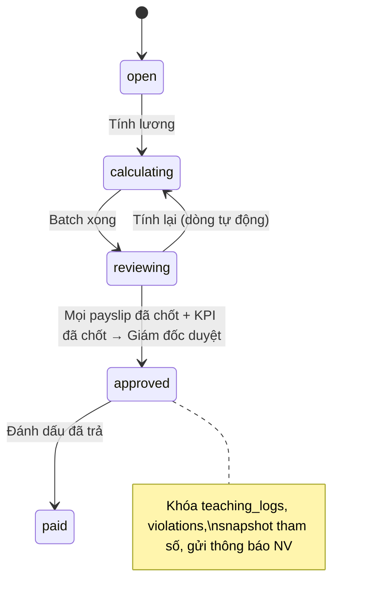

- Khi `approved`: set `payroll_period_id` cho `teaching_logs` trong kỳ, chuyển vi phạm liên quan sang `payroll_deducted`, phát `PayrollApproved`. Phase 2: Finance ghi chi phí lương tự động (mockup Khoản chi vận hành "Chi lương tự động").
- **Lương của tôi** (portal): chỉ xem payslip của chính mình từ trạng thái `closed`, xuất PDF phiếu lương.
- **BXH KPI & Hoa hồng** công khai: chỉ lộ số HS giữ, đơn giá, tổng KPI/hoa hồng, **không** lộ lương cơ bản, khoản trừ, thực nhận.

---

### 6.9 Module Phase 2 (định nghĩa ranh giới, chưa build)

| Module | Trách nhiệm | Contract/Event đã chừa sẵn ở Phase 1 |
|---|---|---|
| `Finance` | Sổ học phí dạng ledger (`tuition_accounts`, `tuition_entries`), khoản thu theo đợt + phụ thu, phiếu thu (draft → pending → approved/rejected/voided) kèm minh chứng, dải số HĐ theo chi nhánh (không tái sử dụng số đã hủy), VNPT e-invoice, hủy HĐ (auto hoàn tác công nợ), hoàn phí/chuyển nhượng/bảo lưu/khất nợ, nhắc nợ (08:30 hằng ngày), DS quá hạn, tài khoản NH + VietQR, chi vận hành, báo cáo doanh thu tạm tính | Nghe `LeadWon` (mở sổ + ghi cọc), `PayrollApproved` (chi lương). Phát `RenewalPaid` → Crm ghi `crm_sales_credits(kind=renewal)` |
| `Operations` | Work task Kanban 2 chiều, TA 3 ca (before/during/after), báo cáo trực lớp + ảnh, xác nhận thủ công, KPI tự động | Nghe `SessionScheduled` để sinh task mẫu cho TA |
| `Inventory` | Sách/học liệu: nhập, xuất theo HV, cảnh báo tồn, đối chiếu ngày 30 | Nghe `EnrollmentConfirmed` (phát giáo trình) |
| `Support` | Ticket TK-, internal note, định tuyến thông báo | |
| `Portal PH/HV` | Lịch học, điểm danh, KQ Big Test, học phí | Đọc qua các Contract hiện có |

---

## 7. Thiết kế Database

### 7.1 Quy ước chung

| Hạng mục | Quy ước |
|---|---|
| Engine / charset | InnoDB, `utf8mb4`, collation `utf8mb4_0900_ai_ci` (tìm kiếm tiếng Việt không dấu) |
| PK | `BIGINT UNSIGNED AUTO_INCREMENT`. Mã nghiệp vụ (KH-, HV-, PT-…) là cột riêng có UK |
| Tiền | `BIGINT` (VND, có dấu để biểu diễn bút toán âm) |
| Tỷ lệ | `DECIMAL(5,2)` |
| Thời gian | `DATETIME` lưu **UTC**, hiển thị `Asia/Ho_Chi_Minh`. Cột ngày nghiệp vụ (ngày dạy, ngày vi phạm) dùng `DATE` theo giờ VN |
| Enum | `VARCHAR(20–30)` + PHP backed enum (đổi giá trị không cần ALTER bảng lớn) |
| Soft delete | Bảng nghiệp vụ chính. Unique key có soft delete thì dùng generated column `IF(deleted_at IS NULL, code, NULL)` |
| Mã hóa | CCCD, số tài khoản NH: Laravel `encrypted` cast + cột `*_hash` (HMAC) nếu cần tìm kiếm |
| Migration | Mỗi module tự quản migration trong `Modules/*/Database/migrations`, prefix timestamp. Không sửa migration đã chạy trên production |

### 7.2 Chống N+1 & tối ưu truy vấn

- Bật `Model::shouldBeStrict()` ở local/testing: lazy load là exception.
- Mọi list screen có Query class riêng, chọn cột cụ thể (`select`), eager load có ràng buộc cột (`with('assignee:id,name')`).
- Đếm/tổng hợp dùng `withCount`/subquery thay vì load collection.
- Cột đếm cache (`classes.active_enrollment_count`) cập nhật trong cùng transaction với thao tác gốc.
- Index phủ (covering) cho các màn nóng: Kanban CRM, Dashboard lớp theo ngày, Lịch của tôi.
- Pest test cho màn nóng: `DB::enableQueryLog()`, assert số query ≤ ngưỡng (VD Kanban ≤ 6 query bất kể số lead).
- Slow query log > 200ms bật trên production, review hằng tuần.

### 7.3 Kỹ thuật DB (dùng có chọn lọc)

| Kỹ thuật | Dùng ở đâu | Không dùng ở đâu |
|---|---|---|
| **Partition RANGE theo tháng** | `activity_log`, `notifications`, `outbox_messages` (bảng log ghi nhiều, xóa theo tuổi). Lưu ý MySQL bắt buộc cột partition nằm trong mọi unique key, nên PK là `(id, created_at)`. Job hằng tháng tạo partition mới và drop partition > 24 tháng | Bảng nghiệp vụ: dữ liệu vài trăm nghìn dòng/năm, không cần |
| **Generated column + UNIQUE** | R19 (1 chặng active/lớp), 1 syllabus active/level, 1 enrollment active, unique với soft delete | |
| **`SELECT … FOR UPDATE`** | Sinh mã chứng từ, kiểm sĩ số lớp khi chốt, chốt kỳ lương | Đọc thông thường |
| **Window function** | Kanban top-N mỗi cột, xếp hạng BXH KPI | |
| **FULLTEXT ngram** | Tìm tên lead/HV | SĐT dùng index B-tree prefix |
| **Read replica** | Báo cáo, dashboard, export (Sprint 12) | Ghi và đọc-sau-ghi |

### 7.4 Ước lượng dữ liệu (3 năm, 8.000 HV, 150 NV)

| Bảng | Số dòng ước tính | Ghi chú |
|---|---|---|
| `crm_leads` | ~60.000 | |
| `crm_lead_activities` | ~600.000 | |
| `class_sessions` | ~70.000 | 250 lớp × 3 buổi/tuần |
| `attendances` | ~1.000.000 | Lớn nhất trong nghiệp vụ, index `(session_id, student_id)` đủ |
| `teaching_logs` | ~150.000 | |
| `payslip_lines` | ~150.000 | |
| `activity_log` | ~5–10 triệu | Partition |

Quy mô này MySQL 1 node (4 vCPU / 8 GB RAM, `innodb_buffer_pool_size` 5 GB) xử lý thoải mái.

---

## 8. Luồng nghiệp vụ xuyên module

### 8.1 Closing Wizard (Phase 1)

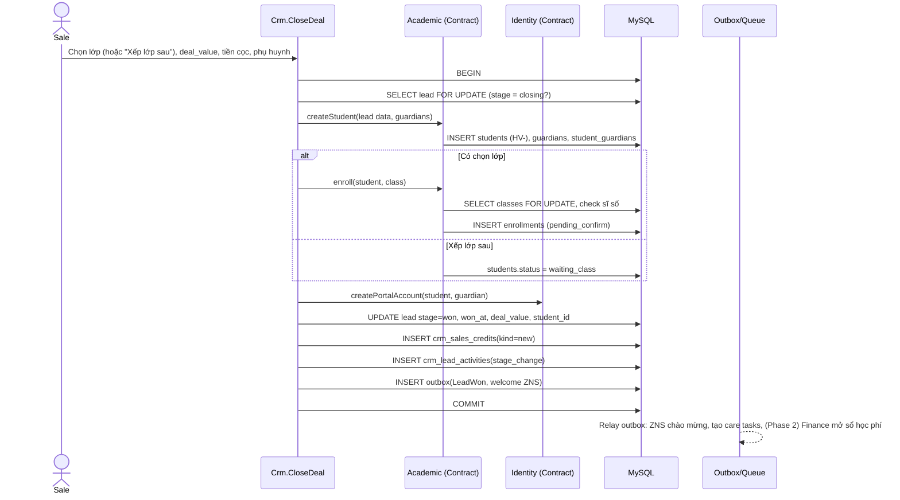

- Học vụ bấm **"Xác nhận chính thức"** (mockup Epic 6) thì enrollment `pending_confirm → active`, student `studying/trial`.
- Lỗi ở bất kỳ bước nào thì rollback toàn bộ. Side effect ngoài hệ thống chỉ chạy sau commit (outbox).

### 8.2 Hoàn thành chặng (Lịch ↔ Syllabus)

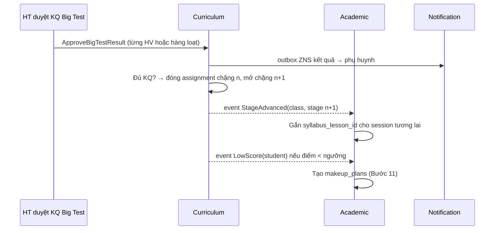

### 8.3 Từ lịch đến lương

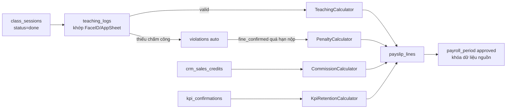

---

## 9. Phân quyền & Bảo mật

### 9.1 Ma trận quyền (4 trụ cột)

| Permission | admin | manager | academic_head | academic_staff | sales | teacher | assistant | accountant |
|---|:-:|:-:|:-:|:-:|:-:|:-:|:-:|:-:|
| `crm.view` (scope) | all | branch | – | branch | own | – | – | – |
| `crm.create/update` | ✓ | ✓ | – | – | ✓ own | – | – | – |
| `crm.assign` | ✓ | ✓ | – | – | – | – | – | – |
| `crm.close_deal` | ✓ | ✓ | – | – | ✓ own | – | – | – |
| `crm.stage_rollback` | ✓ | ✓ | – | – | – | – | – | – |
| `assessment.manage_tests` | ✓ | – | ✓ | ✓ | – | – | – | – |
| `assessment.grade` | ✓ | – | ✓ | – | – | ✓ | – | – |
| `schedule.manage` (TKB, lớp) | ✓ | ✓ | – | ✓ | – | – | – | – |
| `schedule.force` (bỏ qua xung đột) | ✓ | ✓ | – | – | – | – | – | – |
| `attendance.mark` | ✓ | ✓ | – | ✓ backup | – | ✓ own class | ✓ | – |
| `syllabus.manage` | ✓ | – | ✓ | – | – | – | – | – |
| `syllabus.assign_stage` | ✓ | – | ✓ | ✓ | – | – | – | – |
| `bigtest.approve` | ✓ | – | ✓ | – | – | – | – | – |
| `material.view` | theo `material_audiences` | | | | | | | |
| `timesheet.manual` | ✓ | ✓ | – | – | – | – | – | ✓ |
| `violation.confirm_academic` | ✓ | – | ✓ | – | – | – | – | – |
| `violation.confirm_operational` | ✓ | ✓ | – | – | – | – | – | – |
| `payroll.calculate/review` | ✓ | – | – | – | – | – | – | ✓ |
| `payroll.approve` | ✓ | – | – | – | – | – | – | – |
| `payroll.view_own` | ✓ | ✓ | ✓ | ✓ | ✓ | ✓ | ✓ | ✓ |

Truy cập tài nguyên ngoài scope thì trả **404** (không lộ sự tồn tại), sai quyền hành động thì trả **403**.

### 9.2 Bảo mật

- Đăng nhập: Laravel Fortify, **2FA TOTP bắt buộc** cho `admin`, `accountant`. Khóa tạm sau 5 lần sai (rate limit theo email + IP).
- Session trên Redis, `SESSION_SECURE_COOKIE`, `SameSite=Lax`, idle timeout 2h.
- CSRF (Blade mặc định), CSP header, sanitize HTML rich text của syllabus bằng HTMLPurifier.
- Upload: whitelist MIME + kiểm tra magic bytes, giới hạn kích thước theo loại (ảnh 10MB, tài liệu 50MB), lưu MinIO private, tên file ngẫu nhiên. Có thể thêm ClamAV sidecar ở Phase 2.
- Public test portal: token ULID 1 lần, rate limit, reCAPTCHA/Turnstile khi làm bài không qua link mời.
- Audit mọi thao tác ghi, ẩn trường nhạy cảm (`password`, `national_id`, `bank_account_no`).
- Secrets qua Kubernetes Secret (Sealed Secrets/SOPS trong Git).
- Backup mã hóa, test restore hằng tháng.

---

## 10. Tích hợp bên ngoài

| Hệ thống | Mục đích | Cách tích hợp | Phase |
|---|---|---|---|
| **Zalo ZNS** | Link test đầu vào, KQ Big Test, chào mừng HV, (P2) nhắc học phí | `ZnsClient` qua outbox, queue `notifications`, retry exponential, lưu `zns_logs` (msg_id, status, cost) | 1 |
| **Lark** | Thông báo nội bộ: lead quá SLA, SLA đề Big Test, yêu cầu giãn tiến độ, kỳ lương chờ duyệt. Đồng bộ danh bạ | Lark Bot webhook + Open API (map `users.lark_user_id`) | 1 |
| **AppSheet / FaceID** | Log chấm công | Adapter `TimesheetSourceContract`, pull định kỳ | 1 |
| **Gotenberg** | Convert DOCX/PPTX → PDF cho viewer tài liệu, render PDF phiếu lương | Container nội bộ trong cluster | 1 |
| **VietQR** | QR thu tiền gắn mã HV | Sinh URL/payload theo chuẩn NAPAS | 2 |
| **SePay/Casso** | Tự đối soát chuyển khoản | Webhook có HMAC | 2 |
| **VNPT Invoice** | Phát hành/hủy HĐ điện tử | SOAP client, outbox | 2 |

Mọi client ngoài: timeout rõ ràng, circuit breaker đơn giản (Redis counter), log request/response (đã mask), có bản **fake** cho môi trường dev/test.

---

## 11. Hạ tầng, CI/CD, Vận hành

### 11.1 Môi trường

| Env | Hạ tầng | Ghi chú |
|---|---|---|
| local | Docker Compose (app, mysql, redis, minio, mailpit, gotenberg) | `make up`, seed dữ liệu mẫu 3 chi nhánh |
| staging | k3s namespace `staging` | Deploy tự động khi merge vào `develop` |
| production | k3s namespace `prod` (3 node: 1 server + 2 agent, 4 vCPU/8GB) + VM MySQL (4 vCPU/8GB/SSD) + MinIO (VM hoặc S3 dịch vụ trong nước) | Deploy khi tạo tag `v*`, ArgoCD sync có approval |

### 11.2 Dockerfile (multi-stage)

```dockerfile
# 1) PHP deps
FROM composer:2 AS vendor
WORKDIR /app
COPY composer.json composer.lock ./
RUN composer install --no-dev --no-scripts --prefer-dist --no-interaction --optimize-autoloader

# 2) Frontend assets
FROM node:22-alpine AS assets
WORKDIR /app
COPY package*.json vite.config.js ./
RUN npm ci
COPY resources ./resources
COPY app/Modules ./app/Modules
RUN npm run build

# 3) Runtime
FROM php:8.4-fpm-alpine AS runtime
RUN apk add --no-cache icu-libs libzip libpng \
 && docker-php-ext-install pdo_mysql intl zip bcmath opcache pcntl \
 && pecl install redis && docker-php-ext-enable redis
WORKDIR /var/www
COPY --from=vendor /app/vendor ./vendor
COPY . .
COPY --from=assets /app/public/build ./public/build
COPY docker/php/opcache.ini /usr/local/etc/php/conf.d/opcache.ini
RUN php artisan event:cache && php artisan view:cache \
 && chown -R www-data:www-data storage bootstrap/cache
USER www-data
CMD ["php-fpm"]
```

`config:cache` và `route:cache` chạy ở entrypoint (vì env inject lúc runtime). Migration chạy bằng **Helm pre-upgrade Job** (`php artisan migrate --force`), không chạy trong container web.

### 11.3 Pipeline CI

```
lint (pint --test, rector --dry-run)
  → static (larastan, deptrac)
  → test (pest --parallel, MySQL + Redis service, coverage ≥ 70% Domain/Application)
  → build image (tag = git sha) → push registry
  → deploy staging (ArgoCD) → smoke test
  → [manual] promote tag → prod
```

### 11.4 Vận hành

- **Giám sát:** Sentry (lỗi), Pulse (slow query, slow job, queue), Prometheus + Grafana (CPU/RAM, MySQL exporter, Redis exporter), Loki (log JSON có `request_id`).
- **Cảnh báo** (qua Lark): error rate tăng, queue `payroll`/`notifications` tồn > 5 phút, MySQL replication lag, disk > 80%, ZNS lỗi liên tục.
- **Backup:** XtraBackup full hằng đêm + binlog liên tục (PITR 7 ngày), đẩy lên storage khác vùng. MinIO mirror sang bucket dự phòng. RPO ≤ 15 phút, RTO ≤ 2 giờ.
- **Scheduler jobs:** `crm:scan-stale` (15'), `schedule:attendance-reminder` (hằng giờ), `bigtest:sla-reminder` (08:00), `timesheet:sync` (15'), `hr:contract-expiry` (08:00), `partition:rotate` (ngày 1 hằng tháng), `outbox:relay` (liên tục trong Horizon).

---

## 12. Chiến lược kiểm thử

| Tầng | Công cụ | Trọng tâm |
|---|---|---|
| Unit (Domain) | Pest, không DB | `SessionGenerator` (ngày nghỉ, dời buổi), `ScheduleConflictDetector`, `CrmStageMachine`, `ScoringService` (thang YLE), `RateResolver`, từng `PayCalculator`, `PermissionResolver` |
| Feature | Pest + MySQL thật (RefreshDatabase) | Mọi Action, Policy (403/404), Closing Wizard (có lớp / xếp sau / lớp đầy), R19, chốt kỳ lương khóa dữ liệu, sync không ghi đè kỳ đã khóa |
| Architecture | Pest `arch()` + Deptrac | Ranh giới module, Domain không phụ thuộc framework |
| Performance | Query count assertion, k6 cho Kanban/Dashboard | Kanban ≤ 6 query, Dashboard ngày < 300ms p95 |
| Concurrency | Test 2 process song song (`pcntl_fork` hoặc 2 connection) | Chốt 2 HV cùng lúc vào lớp còn 1 chỗ; sinh mã chứng từ không trùng |
| E2E (tối thiểu) | Laravel Dusk | Luồng vàng: tạo lead → test → chốt → xếp lớp → điểm danh → chấm công → tính lương |

Bộ test case trong `test-cases-unitest-flows.html` và `unitest-crm.xlsx` được chuyển thành **Pest dataset** tương ứng, gồm cả 8 gap còn pending.

---

## 13. Gap Analysis & Câu hỏi cần BA chốt

### 13.1 Chênh lệch giữa BPMN / Mockup / Schema cũ (đã xử lý trong thiết kế)

| # | Chênh lệch | Xử lý trong thiết kế |
|---|---|---|
| G1 | Schema cũ **không có bảng điểm danh**, chỉ có counter `attended_lessons` | Thêm `class_sessions` + `attendances` |
| G2 | Không có khái niệm **buổi học (session)** và **phòng** | Thêm `class_sessions`, `rooms`, `session_staff`, check xung đột |
| G3 | Không có **phụ huynh** (BPMN có làn PH) | Thêm `guardians`, `student_guardians`, role `guardian` |
| G4 | Syllabus schema cũ là curriculum → unit; mockup là **chặng → buổi**, có giao chặng R19, unlock policy, SLA đề | Thiết kế lại module `Curriculum` |
| G5 | Vi phạm: schema 4 trạng thái, mockup 7 bước + giải trình + phân HT/CM chốt | State machine mới (mục 6.7) |
| G6 | Đơn giá GV: schema theo rank; mockup theo từng GV, **có lịch sử hiệu lực**, đơn vị buổi/giờ/phút | `rate_cards` effective-dated |
| G7 | Hoa hồng: schema theo **doanh thu**, mockup theo **số học viên** | `commission_tiers.metric` hỗ trợ cả hai (xem Q3) |
| G8 | Lương: schema hard-code KPI "+1tr nếu ≥40h", phụ cấp "+500k"; mockup có KPI giữ HS, phí công đoàn 0.5%, phụ cấp mở rộng, 4 mẫu lương | Engine line-based + calculator theo template |
| G9 | Stage CRM: schema 6, mockup 8 | Stage machine mục 6.2.1 (xem Q1) |
| G10 | Trạng thái HV: schema 4, mockup 7 | Enum 7 trạng thái |
| G11 | Test đầu vào: schema CEFR 4 kỹ năng, mockup thang YLE theo khối | Thang điểm cấu hình được |
| G12 | Chấm công: tài liệu nói FaceID, mockup nói AppSheet | Adapter cho cả hai |
| G13 | Scan lead sót chạy khi admin mở trang | Chuyển sang scheduler |
| G14 | Kho sách (B18), Ôn thi học kỳ (B21) chưa có bảng/màn hình | B21 thiết kế tối giản trong Curriculum; B18 để Phase 2 |

### 13.2 Câu hỏi cần chốt (chặn sprint tương ứng)

| # | Câu hỏi | Ảnh hưởng | Cần trước |
|---|---|---|---|
| Q1 | Stage CRM chuẩn là 8 bước như mockup? "Test" (đang test) có phải stage riêng không, hay là trạng thái của lịch hẹn? "Chờ xếp lớp" là trước hay sau khi chốt? | Stage machine, báo cáo funnel | Sprint 2 |
| Q2 | Có cho lùi stage không (mockup có dropdown "Sửa giai đoạn")? | Rule chỉ-tiến | Sprint 2 |
| Q3 | Hoa hồng tuyển sinh tính theo **số HV** hay **doanh thu**? Thưởng tái tục tính trên gì? Hoa hồng ghi nhận lúc chốt deal hay lúc thu đủ tiền? | Payroll | Sprint 10 |
| Q4 | Phạt: nộp trong 2 ngày, quá hạn thì trừ lương, đúng không? Nếu đã nộp tiền mặt thì không trừ lương? | Discipline ↔ Payroll | Sprint 10 |
| Q5 | KPI giữ HS: công thức "tỷ lệ giữ chân" (retention) tính thế nào (HV còn học cuối kỳ / đầu kỳ)? Ai chốt KPI? | Payroll | Sprint 10 |
| Q6 | Thuế TNCN: nhập tay (như mockup) hay hệ thống tự tính lũy tiến? | Payroll | Sprint 11 |
| Q7 | BHXH tính trên lương cơ bản hay lương đóng BH riêng? GV part-time có đóng không? | Payroll | Sprint 10 |
| Q8 | Chặng mở theo tuần: lịch mở do hệ thống tự tính từ TKB hay HT set tay? | Curriculum | Sprint 7 |
| Q9 | Ngưỡng điểm kích hoạt bổ trợ: < 7 áp dụng cho Big Test hay chỉ ôn thi học kỳ? | Academic/Curriculum | Sprint 8 |
| Q10 | Học thử có phải là buổi học thật của lớp đang chạy không? | Lịch hẹn CRM ↔ session | Sprint 3 |
| Q11 | Chấm công của TA/nhân viên văn phòng có qua FaceID theo ca hành chính không (ngoài buổi dạy)? | Timekeeping | Sprint 9 |
| Q12 | Menu sidebar chính thức? Mockup App Shell có "Hợp đồng", "Lịch hẹn" nhưng chưa có "Giáo trình", "Lương". Đề xuất ở mục 15.5 | App Shell | Sprint 0 |
| Q13 | 17 màn hình Phase 1 **chưa có mockup** (mục 15.7). Designer vẽ tiếp bằng cùng công cụ, hay dev dựng bằng component có sẵn rồi designer duyệt? | Tiến độ S3–S11 | Sprint 1 |
| Q14 | Giao diện mobile: mockup chỉ có desktop. Portal TA/GV dùng nhiều trên điện thoại. Có cần mockup mobile riêng không? | Portal | Sprint 5 |

---

## 14. Kế hoạch Sprint & Theo dõi tiến độ

### 14.1 Giả định

- Team: 1 dev fullstack (Dev) + CTO (review, code phần lõi: engine lương, lịch, kiến trúc).
- Sprint 2 tuần, bắt đầu **Thứ Hai 28/09/2026**. Nghỉ Tết Nguyên đán 2027 (08/02 – 19/02/2027).
- Mỗi sprint kết thúc bằng demo cho người dùng chính của module + retro 30 phút.
- Definition of Done: code review pass, CI xanh (lint, larastan, deptrac, test, **visual regression**), có migration + seeder, test cho Action/Domain, deploy staging, **màn hình đạt checklist UI Fidelity (15.10) và được tick sign-off trong bảng 15.11**, cập nhật Sprint Log (14.5).

### 14.2 Lộ trình

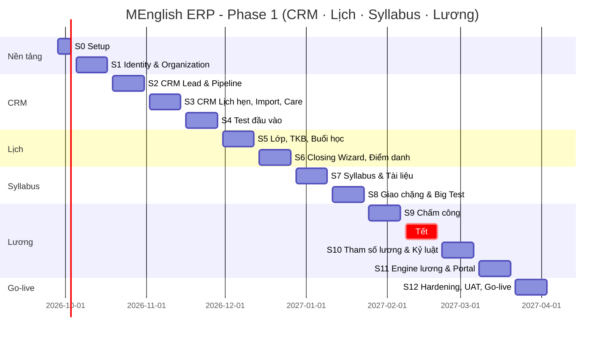

### 14.3 Chi tiết Sprint

| Sprint | Thời gian | Mục tiêu | Hạng mục chính | Deliverable / Demo | Trạng thái |
|---|---|---|---|---|---|
| **S0** | 28/09 – 02/10/2026 | Nền móng kỹ thuật | Init Laravel + PHP 8.4, cấu trúc `app/Modules`, `Shared` (Money, Sequence, Outbox), Docker Compose local, Dockerfile multi-stage, CI (pint, larastan, deptrac, pest), arch test, k3s staging + Helm chart + ArgoCD. **Nền UI:** Tailwind 3.4 + `docs/ui/tailwind.config.js`, font/icon tự host, App Shell (sidebar + topbar) theo mockup, script baseline (`docs/ui/build-baselines.js`) + visual test chạy trong CI, trang so sánh `/_dev/mockups` | Repo chạy `make up`; CI xanh; staging có trang login + App Shell khớp mockup | ⬜ Todo |
| **S1** | 05/10 – 16/10 | Identity & Organization | **Component UI lõi** (PageHeader, Button, Badge, DataTable, Pagination, FilterBar, FormField, Modal, Alert, StatCard, Toast, EmptyState) lấy markup từ mockup golden, Login + 2FA, users, roles (9), permissions, override + resolver + cache, khóa tài khoản tức thì, branch data scope, branches, rooms, danh mục hệ thống, ngày nghỉ, audit log + màn Nhật ký vận hành (diff trước/sau), hồ sơ nhân sự tối thiểu + hợp đồng + cảnh báo hết hạn | Màn: Tài khoản & Vai trò, Phân quyền cá nhân, Danh mục, Ngày nghỉ, Nhật ký vận hành | ⬜ Todo |
| **S2** | 19/10 – 30/10 | CRM lõi | Lead CRUD + mã KH-, stage machine, Kanban (Livewire, drag & drop, top-N/cột), danh sách + filter + FULLTEXT, chi tiết lead + timeline hoạt động, SLA liên hệ + badge quá hạn, phân công lại, data scope sale (404), lost bắt buộc lý do | Màn: Pipeline, Danh sách, Thêm/Sửa, Chi tiết khách | ⬜ Todo |
| **S3** | 02/11 – 13/11 | CRM mở rộng | Lịch hẹn test/học thử (check trùng người chấm), gửi KQ PH, import Excel 3 bước (preview, file lỗi, TTL 30'), scheduler lead quá SLA → in-app + Lark bot, care tasks (chăm sóc tháng đầu, sinh nhật), Khách không chốt, Báo cáo doanh số (funnel theo stage_change) | Màn: Nhập hàng loạt, Khách không chốt, Báo cáo doanh số; thông báo Lark | ⬜ Todo |
| **S4** | 16/11 – 27/11 | Test đầu vào | Thang điểm cấu hình (YLE khối 1-2 … 4-5), band nhận xét, rule gợi ý lớp, ngân hàng đề + câu hỏi (MCQ/điền/nói/viết, upload mp3/ảnh), đề preset + duplicate, gửi link (token), portal làm bài (autosave, hẹn giờ), auto chấm + GV chấm tay, auto nhận xét, link về lead → `tested` | Màn: DS đề, Tạo đề, Chi tiết & nhận xét, Thang điểm; thí sinh làm bài thật trên staging | ⬜ Todo |
| **S5** | 30/11 – 11/12 | Lịch (1) | Trình độ, khóa học, lớp, slot TKB N-slot có hiệu lực, `SessionGenerator` (bỏ qua ngày nghỉ), `ScheduleConflictDetector` (GV/TA/phòng), sinh lại buổi tương lai, Dashboard lớp theo ngày / ma trận tuần, lịch cá nhân GV/TA, báo cáo phòng/nhân sự | Màn: Cấu hình trình độ, TKB, Dashboard lớp học; demo cảnh báo xung đột | ⬜ Todo |
| **S6** | 14/12 – 25/12 | CRM ↔ Lịch | Closing Wizard (có lớp / xếp lớp sau, khóa sĩ số), students + guardians + tài khoản portal, Khách chốt thành công / Chờ xếp lớp / Xác nhận chính thức, hồ sơ HV (7 trạng thái, lộ trình buổi học, quyền xem/sửa), điểm danh (GV + backup, khóa 24h), đối soát điểm danh, makeup plans | Màn: Chốt & Xếp lớp, Khách chốt, DS & liên kết lớp, Chi tiết HS. 🚀 **Release 1: pilot CRM + Lịch tại 1 chi nhánh** | ⬜ Todo |
| **S7** | 28/12/2026 – 08/01/2027 | Syllabus (1) | Syllabus + version + active/level, chặng (score range, unlock policy, overview), buổi học (rich text sanitize, BTVN, đính kèm), phân công soạn + tiến độ %, đề xuất sửa giáo trình + duyệt, tài liệu: upload MinIO, Gotenberg convert, viewer PDF.js + watermark, đối tượng xem, khóa tải | Màn: Soạn syllabus theo chặng, Tài liệu giáo trình, Đề xuất sửa GT | ⬜ Todo |
| **S8** | 11/01 – 22/01/2027 | Syllabus (2) | Giao chặng (R19, UNIQUE generated column), gắn lesson vào session, xin giãn tiến độ → thêm buổi, Big Test: order đề, duyệt đề + SLA + nhắc 7 ngày, nhập điểm, duyệt KQ, gửi ZNS phụ huynh (outbox), tự mở chặng kế tiếp, điểm thấp → bổ trợ, ôn thi học kỳ tối giản (B21) | Màn: Giao chặng, Điều chỉnh tiến độ, Duyệt & phân phối đề, Nhắc lịch Big Test, Duyệt KQ & gửi PH. 🚀 **Release 2: Syllabus** | ⬜ Todo |
| **S9** | 25/01 – 05/02/2027 | Chấm công | `teaching_logs` từ session, tự check-in, chấm công thủ công (lý do, khóa theo kỳ, 24h), adapter AppSheet/FaceID + khớp buổi, lịch sử đồng bộ + chi tiết lỗi + xuất Excel, rule thiếu vào/ra, vi phạm tự động | Màn: Chấm công thủ công, Chi tiết chấm công GV, Lịch sử đồng bộ | ⬜ Todo |
| — | 08/02 – 19/02/2027 | **Nghỉ Tết** | | | |
| **S10** | 22/02 – 05/03/2027 | Tham số lương & Kỷ luật | Pay profile theo template, `rate_cards` (lịch sử, đơn vị buổi/giờ/phút), `commission_tiers` (new/renewal, metric), KPI tiers, phụ cấp, statutory rates, Discipline: state machine 7 bước, giải trình, phân quyền HT/CM chốt, chặn khi kỳ khóa | Màn: Cấu hình đơn giá GV, Mốc hoa hồng & tái tục, Danh sách vi phạm | ⬜ Todo |
| **S11** | 08/03 – 19/03/2027 | Engine lương | Kỳ lương (UK tháng/năm), batch tính lương + tiến độ realtime, 11 calculator, payslip line-based cho 4 mẫu (part-time, full-time, học thuật, học vụ), chốt KPI, chốt/duyệt/đã trả, khóa dữ liệu nguồn + snapshot, PDF phiếu lương, Lương của tôi, BXH KPI & hoa hồng | Màn: DS bảng lương, 4 màn chi tiết lương, BXH KPI, Lương của tôi. 🚀 **Release 3: chạy song song lương tháng 03/2027 với Excel** | ⬜ Todo |
| **S12** | 22/03 – 02/04/2027 | Hardening & Go-live | Đối chiếu lương song song, sửa lệch, load test, tối ưu query, read replica cho báo cáo, backup/restore drill, pentest cơ bản, import dữ liệu thật (nhân sự từ Lark, lead/HV từ Excel), tài liệu hướng dẫn, đào tạo người dùng | 🚀 **Go-live Phase 1 toàn bộ chi nhánh (06/04/2027)**; lương tháng 04/2027 chạy chính thức trên hệ thống | ⬜ Todo |

**Phase 2 (dự kiến từ 04/2027):** Finance (học phí, phiếu thu, HĐ VNPT, nhắc nợ, VietQR + SePay), Operations (giao việc, TA 3 ca, báo cáo trực lớp), Portal PH/HV, Inventory, Helpdesk, Dashboard theo vai trò.

### 14.4 Bảng theo dõi tiến độ

> Cập nhật cuối mỗi sprint. Trạng thái: ⬜ Todo · 🟦 In progress · ✅ Done · ⚠️ Trễ/Rủi ro · ⏸️ Hoãn.

| Sprint | Trạng thái | % hoàn thành | Ngày demo | Ghi chú rủi ro |
|---|---|---|---|---|
| S0 | ⬜ | 0% | 02/10/2026 | |
| S1 | ⬜ | 0% | 16/10/2026 | |
| S2 | ⬜ | 0% | 30/10/2026 | Cần chốt Q1, Q2 |
| S3 | ⬜ | 0% | 13/11/2026 | Cần chốt Q10; tài khoản Lark bot |
| S4 | ⬜ | 0% | 27/11/2026 | Cần bộ đề + thang điểm thật từ HT |
| S5 | ⬜ | 0% | 11/12/2026 | Cần danh sách phòng + TKB hiện tại |
| S6 | ⬜ | 0% | 25/12/2026 | Release 1 |
| S7 | ⬜ | 0% | 08/01/2027 | Cần chốt Q8 |
| S8 | ⬜ | 0% | 22/01/2027 | Cần template ZNS được Zalo duyệt (xin trước 2–3 tuần) |
| S9 | ⬜ | 0% | 05/02/2027 | Cần chốt Q11; quyền truy cập API AppSheet/FaceID |
| S10 | ⬜ | 0% | 05/03/2027 | Cần chốt Q3, Q4, Q5, Q7 |
| S11 | ⬜ | 0% | 19/03/2027 | Cần chốt Q6; bảng lương Excel tháng trước để đối chiếu |
| S12 | ⬜ | 0% | 02/04/2027 | Go-live |

### 14.5 Sprint Log (điền sau mỗi sprint)

```markdown
#### Sprint Sx — <tên> (dd/mm – dd/mm)
**Mục tiêu:** ...
**Đã làm:**
- [x] ...
**Chưa làm / chuyển sprint sau:**
- [ ] ... → lý do, chuyển sang Sy
**Thay đổi thiết kế phát sinh:** (link ADR nếu có)
**Bug tồn đọng:** ...
**Số liệu:** story hoàn thành x/y · test coverage Domain z% · query chậm nhất w ms
**Demo feedback:** ...
```

_(Chưa có sprint nào được thực hiện.)_

### 14.6 Rủi ro chính & giảm thiểu

| Rủi ro | Mức | Giảm thiểu |
|---|---|---|
| 1 dev là single point of failure | Cao | CTO review mọi PR, tài liệu ADR, code theo convention nghiêm ngặt để người sau đọc được, CI chặn vi phạm |
| Nghiệp vụ lương chưa chốt (Q3–Q7) | Cao | Chốt trước S10. Engine line-based đổi rule không đổi schema. Chạy song song Excel 1 tháng |
| Template ZNS chờ Zalo duyệt lâu | Trung bình | Nộp template từ S5. Fallback: gửi qua Lark/SMS/email |
| Dữ liệu FaceID/AppSheet không chuẩn | Trung bình | Adapter + màn lỗi đồng bộ + chấm công thủ công |
| Scope creep từ Phase 2 (học phí) | Trung bình | Closing Wizard Phase 1 chỉ ghi deal value + cọc, Finance tách hẳn sang Phase 2 |

---

## 15. UI Fidelity — Bám sát mockup

> **Mục tiêu:** Giao diện thật giống mockup về **màu sắc, typography, bố cục, khoảng cách, icon, trạng thái**. Mức giống được **đo bằng máy** (visual regression) chứ không chỉ dựa vào mắt review.
> **Quyết định (25/09/2026):** Nguồn chuẩn là `code.html` render bằng **bộ token chung**. Các lỗi hiển thị có sẵn trong mockup được **sửa theo ý đồ thiết kế**, không tái hiện lỗi.

### 15.1 Thứ tự ưu tiên nguồn chuẩn

| Ưu tiên | Nguồn | Dùng để làm gì |
|---|---|---|
| 1 | `docs/ui/tailwind.config.js` (token chung, trích từ 66 mockup) | Màu, font, cỡ chữ, bo góc, spacing. **Không màn nào được tự định nghĩa lại token** |
| 2 | `code.html` của từng màn | Bố cục, cấu trúc DOM, class Tailwind, nội dung chữ, icon |
| 3 | `DESIGN.md` (bản "MENGLISH Admin") | Quy tắc cho các trạng thái mockup không vẽ: hover, focus, disabled, loading, empty, lỗi validate, responsive |
| 4 | `screen.png` | Chỉ tham khảo nhanh. **Không dùng làm chuẩn pixel** (xem 15.2) |

### 15.2 Kết quả phân tích mockup (tự động, 25/09/2026)

**Phương pháp:** render cả 66 `code.html` bằng Tailwind 3.4 + font tự host ở viewport 1440×900, theo 2 cách: (a) config riêng của từng màn (tương đương bản designer đang xem), (b) bộ token chung. So sánh từng pixel, coi là khác nếu lệch trên 8/255 ở bất kỳ kênh màu nào.

| Phát hiện | Số liệu | Hệ quả |
|---|---|---|
| Mỗi màn nhúng một bản `tailwind.config` riêng (mockup sinh bằng AI từng màn) | 63 biến thể config / 66 màn | Nếu copy nguyên từng màn thì hệ thống lệch nhau. **Bắt buộc gom về 1 bộ token** |
| Token màu/typography đồng thuận cao | `primary` #a23f00 ở 62/66 màn, `primary-container` #f5691a 62/66, fontSize 9 key giống hệt ở 59/60 màn | Bộ token chung là nguồn đáng tin |
| **Bộ token chung tái hiện mockup** | **60/66 màn giống hệt khi nhìn bằng mắt** (53 màn khớp từng pixel, 7 màn lệch < 1% do glyph "→" và làm tròn subpixel) | Chiến lược khả thi |
| 3 màn mockup **thiếu token** (không khai báo `fontSize`/`fontFamily`, nên class `text-body-base`… không có tác dụng và chữ rơi về 16px mặc định) | Khách không chốt, Khách chốt – Xác nhận chính thức, Duyệt KQ Big Test | `screen.png` các màn này chụp từ **bản lỗi**. Làm theo token (quyết định 15.1) |
| 1 màn dùng biến thể `DESIGN.md` thứ 2 ("ME Education Admin System") | Cấu hình Trình độ & Syllabus | Chuẩn hóa về token chung (khác biệt nhỏ về padding và tông nền) |
| 3 màn Tài chính dùng bảng màu riêng (`brand`, `navy`, `primary`=#f5691a) | Phase 2 | Chuẩn hóa khi làm Phase 2 |
| Ảnh `screen.png` có lỗi render | Màn lương bị **rơi font serif** (Be Vietnam Pro không tải được lúc chụp). Chữ **vỡ dòng** trong nút ("Chốt bảng lương", "Cập nhật lịch", "Tạo lớp mới") và badge ("ĐANG HIỆU LỰC" vỡ 3 dòng) | Tự host font, thêm quy tắc chống vỡ dòng (15.4) |
| Class tùy biến rải rác | 95 nút chính dùng **81** tổ hợp class khác nhau, 681 chỗ `text-[..px]`, 97 mã màu hex viết thẳng | Gom thành component (15.6) và lint chặn giá trị tùy biến mới (15.8) |
| Chỉ 1 màn có khung App Shell. Các màn khác là **vùng nội dung** (được nhúng vào navigator `index.html`) | 65/66 màn content-only | App Shell là 1 component riêng. Visual test so sánh vùng `<main>` |
| Ảnh đại diện lấy từ `googleusercontent.com` | 22 màn | Thay bằng avatar chữ cái đầu (mẫu có sẵn trong mockup) hoặc ảnh upload thật |

### 15.3 Design tokens

File chuẩn: **`docs/ui/tailwind.config.js`** (Tailwind 3.4, sinh tự động, **không sửa tay**). Khi init repo (S0) thì copy vào gốc repo.

| Nhóm | Token chính | Giá trị |
|---|---|---|
| Màu thương hiệu | `primary` / `primary-container` / `on-primary` | #a23f00 (chữ, viền nhấn) / **#f5691a** (nút CTA cam) / #ffffff |
| Màu phụ | `secondary` / `tertiary` / `error` | #1e43e7 (xanh dương, focus, link) / #256d00 (xanh lá, thành công) / #ba1a1a |
| Nền | `background` = `surface` / `surface-container-lowest` / `surface-container-low` | #f9f9ff (nền trang, tím nhạt) / #ffffff (card) / #f1f3ff (header bảng) |
| Chữ | `on-surface` / `on-surface-variant` / `outline` / `outline-variant` | #161c27 / #594137 / #8d7165 / #e1bfb2 (viền input, card) |
| Sidebar | `sidebar` (mới) | #111a2b (navy, lấy từ App Shell). Tách khỏi `inverse-surface` (#2a303d) vốn là màu toast/tooltip ở 8 màn khác |
| Kanban CRM | `stage-new`, `stage-consulting`, `stage-test_scheduled`, `stage-tested`, `stage-result_sent`, `stage-closing`, `stage-won`, `stage-lost` | Lấy theo màu cột trong mockup Pipeline |
| Trạng thái công việc | `status-new/progress/pending/blocked/done/overdue/canceled` | Theo mockup "Danh sách công việc" |
| Font | `font-h1…font-caption` = Be Vietnam Pro; `font-code` = JetBrains Mono | Số tiền, SĐT, mã chứng từ dùng `font-code`. Các alias `body-main`, `h2-desktop`, `h3-card`, `label-caps`… (từ biến thể DESIGN.md thứ 2) được giữ để markup màn Cấu hình trình độ không vỡ; code mới không dùng |
| Cỡ chữ | `text-h1` 28/36 700 · `text-h2` 22/30 600 · `text-h3` 18/26 600 · `text-body-base` 14/20 · `text-body-medium` 14/20 500 · `text-body-small` 13/18 · `text-label` 11/16 600 +0.05em · `text-caption` 11/16 · `text-code` 13/18 | |
| Bo góc | `rounded` 4px · `rounded-lg` 8px · `rounded-xl` 12px · `rounded-full` | Theo code mockup (khác bảng trong DESIGN.md, **code thắng** vì là thứ đang hiển thị) |
| Spacing | `xs` 4 · `sm` 8 · `md` 16 · `lg` 24 · `xl` 32 · `gutter` 16 · `header-height` 64 · `sidebar-width` 240 | |
| Đổ bóng | `shadow-level-2` (hover card) · `shadow-level-3` (modal/dropdown) | Theo DESIGN.md |

**Font & icon tự host** (không gọi Google Fonts, tránh lỗi rơi font như ảnh màn lương):

```js
// resources/js/fonts.js
import '@fontsource/be-vietnam-pro/400.css';
import '@fontsource/be-vietnam-pro/500.css';
import '@fontsource/be-vietnam-pro/600.css';
import '@fontsource/be-vietnam-pro/700.css';
import '@fontsource/jetbrains-mono/400.css';
import '@fontsource/material-symbols-outlined/400.css';
```

```css
/* resources/css/app.css */
@tailwind base; @tailwind components; @tailwind utilities;
@layer base {
  body { @apply bg-background text-on-surface font-body-base text-body-base antialiased; }
}
@layer components {
  .material-symbols-outlined { font-family: 'Material Symbols Outlined'; font-weight: normal; font-style: normal;
    font-size: 24px; line-height: 1; display: inline-block; white-space: nowrap; direction: ltr;
    font-feature-settings: 'liga'; -webkit-font-smoothing: antialiased; font-variation-settings: 'FILL' 0, 'wght' 400; }
}
```

Preload `be-vietnam-pro-400/600` (woff2) trong `<head>` để không nháy font khi tải trang.

### 15.4 Lỗi hiển thị trong mockup và cách sửa (patch có chủ đích)

Mọi chỗ "khác mockup" có chủ đích phải có trong bảng này. PR nào thêm khác biệt mới phải cập nhật bảng.

| # | Lỗi trong mockup | Cách sửa | Áp dụng |
|---|---|---|---|
| P1 | Chữ vỡ dòng trong nút, badge, chip, tab | Component `Button`, `Badge`, `Tab` mặc định `whitespace-nowrap` + `shrink-0` | Toàn hệ thống |
| P2 | SĐT, ngày giờ, số tiền vỡ dòng giữa số ("0912 345 / 678", "14:30 - / 22/10") | `font-code whitespace-nowrap` cho SĐT, tiền, mã chứng từ, ngày giờ | Mọi bảng |
| P3 | Cột bảng hẹp khiến chữ dồn nhiều dòng | Cột dữ liệu ngắn đặt `w-px whitespace-nowrap`. Chỉ cột văn bản dài (lý do, ghi chú) được xuống dòng. Bảng rộng hơn viewport thì cuộn ngang trong card | DataTable |
| P4 | Rơi font serif khi không tải được Google Fonts | Tự host font (15.3), fallback `ui-sans-serif, system-ui` | Toàn hệ thống |
| P5 | 3 màn thiếu token cỡ chữ | Dùng token chung | Khách không chốt, Xác nhận chính thức, Duyệt KQ Big Test |
| P6 | Sidebar dùng `bg-inverse-surface` (trùng token toast) | Token riêng `bg-sidebar` (#111a2b), giữ nguyên màu đang hiển thị | App Shell |
| P7 | Topbar App Shell chật: tab "Theo giai đoạn" vỡ 3 dòng, tên người dùng bị ép | Tab con của module chuyển xuống **thanh tab dưới topbar** (đúng như các màn CRM "Theo giai đoạn / Danh sách / Báo cáo DS / Khách không chốt" đang vẽ). Topbar chỉ còn: tiêu đề, tìm kiếm, chuông, nút tạo mới, avatar | App Shell |
| P8 | Ảnh avatar từ `googleusercontent.com` | Avatar chữ cái đầu (mẫu có sẵn trong mockup) hoặc ảnh upload | Toàn hệ thống |
| P9 | Biến thể thiết kế riêng (Cấu hình trình độ; 3 màn Tài chính) | Chuẩn hóa về token chung | 4 màn |
| P10 | Dữ liệu năm 2023/2024 trong mockup | Dữ liệu thật. Fixture visual test giữ nguyên dữ liệu mockup | – |

### 15.5 App Shell & menu (đề xuất, chờ chốt Q12)

Khung giữ nguyên mockup `crm-ui-mockup/app-shell-layout`: sidebar 240px nền `sidebar`, logo + "HỆ THỐNG QUẢN TRỊ", item active nền cam `primary-container` bo `rounded-lg` đổ bóng cam, nút "Thêm học viên mới" cố định đáy sidebar, "Đăng xuất" chữ đỏ. Topbar 64px nền `surface`.

| Menu (mockup) | Đề xuất Phase 1 | Màn con |
|---|---|---|
| Tổng quan | Giữ | Dashboard theo vai trò |
| Quản lý tuyển sinh | Giữ | Theo giai đoạn · Danh sách · Báo cáo DS · Khách không chốt · Nhập Excel · Đề test đầu vào |
| Lịch hẹn | Giữ | Lịch hẹn test/học thử |
| Hợp đồng | **Hỏi BA** (Q12): hợp đồng học viên (Phase 2 Tài chính) hay hợp đồng lao động (Nhân sự)? | – |
| Học viên | Giữ | Hồ sơ học sinh · Khách chốt / Chờ xếp lớp |
| Lớp học | Đổi tên **"Lớp học & Lịch"** | TKB · Dashboard lớp theo ngày/tuần · Cấu hình trình độ · Ngày nghỉ |
| — | **Thêm "Giáo trình"** | Soạn syllabus · Tài liệu · Giao chặng · Big Test · Điều chỉnh tiến độ · Đề xuất sửa |
| Nhân sự | Giữ | Tài khoản & vai trò · Chấm công · Vi phạm |
| — | **Thêm "Lương"** | Bảng lương theo kỳ · Đơn giá GV · Mốc hoa hồng · BXH KPI |
| Tài chính | Ẩn ở Phase 1 | – |
| Báo cáo · Cấu hình hệ thống · Thông báo · Hỗ trợ | Giữ | |

Menu hiển thị theo quyền (một người không có quyền nào trong nhóm thì ẩn cả nhóm), đúng như test `test_dynamic_navigation_menu_visibility`.

### 15.6 Thư viện component (Blade) và mockup "golden"

Mỗi component lấy **markup và class từ 1 mockup golden**, sau đó mọi màn dùng lại. Không viết class tay cho các phần tử này trong view.

| Component | Mockup golden | Sprint |
|---|---|---|
| `x-layout.app-shell`, `x-layout.sidebar-item` | App Shell | S0 |
| `x-ui.page-header` (tiêu đề h1 + mô tả + actions) | TKB — Quản lý lớp học | S1 |
| `x-ui.tabs` (gạch chân cam) | Khách không chốt | S1 |
| `x-ui.button` (`primary`/`secondary`/`ghost`/`danger-text`, có icon) | DESIGN.md + TKB (Tạo lớp mới / Xuất Excel) | S1 |
| `x-ui.badge` (soft 10% + chấm tròn), `x-ui.status-pill` | Tài khoản & Vai trò; Giao chặng | S1 |
| `x-ui.stat-card` | Tài khoản & Vai trò (4 thẻ số liệu) | S1 |
| `x-ui.data-table`, `x-ui.pagination` | Khách không chốt; Giao chặng | S1 |
| `x-ui.filter-bar` (search + select có nhãn) | Pipeline Kanban | S1 |
| `x-form.field` / `input` / `select` / `date` / `time` | Giao chặng (form trái); TKB (slot) | S1 |
| `x-ui.alert` (`error`/`warning`/`info`, viền trái 4px) | TKB (xung đột lịch); Giao chặng (R19) | S1 |
| `x-ui.modal`, `x-ui.toast`, `x-ui.empty-state`, `x-ui.avatar` | Thêm khách mới; Cấu hình ngày nghỉ (toast); App Shell; Khách không chốt | S1 |
| `x-crm.kanban-column`, `x-crm.kanban-card` (thanh màu trái 4px, chip SLA) | Pipeline Kanban | S2 |
| `x-ui.timeline` | Chi tiết khách hàng | S2 |
| `x-ui.stepper` / wizard | Quy trình Chốt & Xếp lớp; Nhập Excel | S3/S6 |
| `x-ui.money` (font-code, căn phải, âm màu `error`) | Chi tiết bảng lương | S10 |

Ví dụ component lấy nguyên class golden:

```blade
{{-- resources/views/components/ui/button.blade.php --}}
@props(['variant' => 'primary', 'icon' => null, 'type' => 'button'])
@php
$base = 'inline-flex shrink-0 items-center justify-center gap-xs whitespace-nowrap rounded-lg px-md py-2 font-body-medium text-body-medium transition-all active:scale-95 disabled:opacity-50 disabled:pointer-events-none';
$variants = [
    'primary'     => 'bg-primary-container text-white shadow-sm hover:brightness-110',
    'secondary'   => 'bg-surface-container-lowest border border-outline-variant text-on-surface hover:bg-surface-container-low',
    'ghost'       => 'text-on-surface-variant hover:bg-primary-container/10 hover:text-primary',
    'danger-text' => 'text-error hover:bg-error-container/40',
];
@endphp
<button type="{{ $type }}" {{ $attributes->class([$base, $variants[$variant]]) }}>
    @if($icon)<span class="material-symbols-outlined text-[20px]">{{ $icon }}</span>@endif
    {{ $slot }}
</button>
```

### 15.7 Màn hình Phase 1 chưa có mockup (Q13)

17 màn cần cho 4 trụ cột nhưng chưa có mockup:

| Module | Màn hình | Sprint |
|---|---|---|
| Nền tảng | Đăng nhập + 2FA · Hồ sơ cá nhân / đổi mật khẩu | S1 |
| CRM | Lịch hẹn (lịch tuần/tháng) · Trang làm bài test công khai cho thí sinh · Danh sách chăm sóc HV (tháng đầu, sinh nhật) | S3–S4 |
| Lịch | Chi tiết lớp (danh sách buổi, HV, GV) · Điểm danh buổi học · Lịch dạy của tôi (GV/TA) · Xếp buổi bù/bổ trợ · Danh mục phòng học | S5–S6 |
| Syllabus | GV gửi yêu cầu (order) đề Big Test · GV nhập điểm Big Test · Phân công soạn giáo trình · Ôn thi học kỳ | S7–S8 |
| Lương | Cấu hình phụ cấp & tỷ lệ BH/công đoàn/thuế · Chi tiết lương mẫu TA/Sales · NV giải trình vi phạm | S10–S11 |

**Đề xuất:** designer vẽ tiếp bằng **đúng công cụ và DESIGN.md hiện tại**, bàn giao **trước sprint tương ứng ít nhất 1 sprint**. Nếu không kịp, dev dựng bằng component ở 15.6 (không tạo style mới), designer duyệt ảnh trên staging trước khi merge.

### 15.8 Quy trình port 1 màn (bắt buộc)

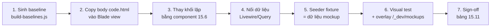

1. **Baseline:** `node docs/ui/build-baselines.js <mockup> tests/Visual/baselines <thư-mục>` sinh ảnh chuẩn từ `code.html` + token chung. Commit ảnh vào repo.
2. **Copy markup:** lấy phần nội dung `<body>` của `code.html` (bỏ App Shell) làm khởi điểm view. **Giữ nguyên class** bố cục/spacing.
3. **Component hóa:** thay button, badge, bảng, input… bằng component. Sau bước này view không còn tổ hợp class dài cho các phần tử này.
4. **Nối dữ liệu:** thay text mẫu bằng biến. **Giữ nguyên nhãn tiếng Việt** (tiêu đề cột, placeholder, nút) đúng từng chữ như mockup.
5. **Fixture:** `Database/Seeders/Visual/<Screen>FixtureSeeder` tạo đúng dữ liệu hiển thị trong mockup (tên, SĐT, số tiền), phục vụ test hình ảnh.
6. **Kiểm tra:**
   - **Visual test** (Playwright chạy trong CI): đăng nhập bằng user fixture, mở route, chụp phần tử `<main>` ở viewport 1440×900, so với baseline. **Ngưỡng: lệch ≤ 1% pixel.** Vùng động (đồng hồ đếm ngược, "5 phút trước") gắn `data-visual-mask` để bỏ qua.
   - **Overlay:** trang `/_dev/mockups/{slug}` (chỉ bật ở local/staging) hiện mockup và màn thật chồng lên nhau, có thanh trượt độ trong suốt. Dev tự soi lệch từng pixel trước khi tạo PR.
7. **Sign-off:** CTO + người dùng nghiệp vụ chính xem trên staging, tick cột "Fidelity sign-off" ở 15.11.

**Lint chặn lệch token (CI):** script kiểm tra view Blade, **cấm** hex tùy biến (`bg-[#...]`, `text-[#...]`) và cỡ chữ tùy biến trùng token (`text-[14px]` thì phải dùng `text-body-base`). Ngoại lệ ghi comment `{{-- ui-allow: lý do --}}`.

### 15.9 Trạng thái & responsive (mockup không vẽ)

| Hạng mục | Quy tắc (theo DESIGN.md) |
|---|---|
| Hover | Card: `shadow-level-2`. Hàng bảng: nền `surface-container-low`. Nút primary: `brightness-110` |
| Focus | Input: viền `secondary` 1px + glow 2px (`ring-2 ring-secondary/20`). Mọi phần tử tương tác có `focus-visible` |
| Loading | Livewire `wire:loading`: skeleton cùng kích thước khối, nút hiện spinner và giữ nguyên độ rộng |
| Empty | `x-ui.empty-state` (icon lưới + tiêu đề xám, theo App Shell mockup) |
| Lỗi validate | Chữ `error` 13px dưới field, viền `error`. Toast lỗi dùng `x-ui.toast` |
| Responsive | ≥1200px: mặc định như mockup. 768–1199px: sidebar thu còn icon (72px). <768px: sidebar ẩn, mở bằng drawer; bảng cuộn ngang trong card |
| Portal GV/TA trên điện thoại | Mockup "Nhiệm vụ hôm nay" đã có thanh điều hướng đáy (Nhiệm vụ · Lớp học · Báo cáo · Cá nhân). Dùng làm mẫu cho các màn portal mobile (Q14) |

### 15.10 Checklist UI Fidelity (Definition of Done cho mỗi màn)

- [ ] Baseline đã sinh và commit. Visual test pass (lệch ≤ 1%)
- [ ] Không có hex/cỡ chữ tùy biến ngoài danh sách ngoại lệ (lint pass)
- [ ] Nhãn, placeholder, tiêu đề cột đúng từng chữ như mockup
- [ ] Icon đúng tên Material Symbols như mockup
- [ ] Đã áp dụng P1–P3 (không vỡ dòng nút/badge/SĐT/tiền/ngày)
- [ ] Đủ trạng thái hover/focus/loading/empty/lỗi theo 15.9
- [ ] Kiểm tra ở 3 độ rộng: 1440, 1024, 390
- [ ] Nếu khác mockup có chủ đích: đã thêm vào bảng 15.4
- [ ] CTO + người dùng nghiệp vụ sign-off trên staging

### 15.11 Bảng kiểm kê màn hình & sign-off

> Cột "Token chung vs mockup" là kết quả đo tự động ngày 25/09/2026 (mục 15.2). Cột "Fidelity sign-off" tick khi màn thật đạt checklist 15.10.
> Phase 1: **47 màn có mockup + 17 màn chưa có mockup (15.7)**. Phase 2: 19 màn.

| # | Sprint | Module | Màn hình | Thư mục mockup | Token chuẩn vs mockup | Fidelity sign-off |
|---|---|---|---|---|---|---|
| 1 | S0 | Nền tảng | App Shell (sidebar + topbar) | `crm-ui-mockup/app-shell-layout` | ✅ Khớp 100% | ⬜ |
| 2 | S1 | Nền tảng | Cấu hình Ngày nghỉ | `epic-5/cau-hinh-ngay-nghi` | ✅ Khớp 100% | ⬜ |
| 3 | S1 | Nền tảng | Nhật ký vận hành | `epic-5/nhat-ky-van-hanh` | ✅ Khớp 100% | ⬜ |
| 4 | S1 | Nền tảng | Phân quyền chi tiết theo cá nhân | `epic-5/phan-quyen-chi-tiet-ca-nhan` | ✅ Khớp 100% | ⬜ |
| 5 | S1 | Nền tảng | Quản lý Danh mục hệ thống | `epic-5/quan-ly-danh-muc-he-thong` | ✅ Khớp 100% | ⬜ |
| 6 | S1 | Nền tảng | Quản lý Tài khoản & Vai trò | `epic-5/quan-ly-tai-khoan-vai-tro` | ✅ Khớp 100% | ⬜ |
| 7 | S2 | CRM | Chi tiết Khách hàng | `crm-ui-mockup/chi-tiet-khach-hang` | ✅ Khớp 100% | ⬜ |
| 8 | S2 | CRM | Danh sách Khách | `crm-ui-mockup/danh-sach-khach` | ✅ Khớp 100% | ⬜ |
| 9 | S2 | CRM | Pipeline Kanban (theo giai đoạn) | `crm-ui-mockup/pipeline-tong-quan-giai-doan` | ✅ Khớp 100% | ⬜ |
| 10 | S2 | CRM | Sửa thông tin khách | `crm-ui-mockup/sua-thong-tin-khach` | ✅ Khớp 100% | ⬜ |
| 11 | S2 | CRM | Thêm khách mới | `crm-ui-mockup/them-khach-moi` | ✅ Khớp 100% | ⬜ |
| 12 | S3 | CRM | Báo cáo doanh số | `crm-ui-mockup/bao-cao-doanh-so` | ✅ Khớp 100% | ⬜ |
| 13 | S3 | CRM | Khách không chốt (Lost deals) | `crm-ui-mockup/khach-khong-chot-lost-deals` | ⚠️ Lỗi mockup: thiếu token cỡ chữ → theo token | ⬜ |
| 14 | S3 | CRM | Nhập danh sách khách hàng loạt (Excel) | `hoc-phi-va-hoa-don-ui-mockup/nhap-danh-sach-hang-loat` | ✅ Khớp 100% | ⬜ |
| 15 | S4 | Test đầu vào | Chi tiết khách: Đề test online & Thang điểm | `quan-ly-de-dau-vao-crm/kh_i_test_online_chi_ti_t_kh_ch_h_ng_menglish_admin` | ✅ Khớp 100% | ⬜ |
| 16 | S4 | Test đầu vào | Quản lý đề test đầu vào | `quan-ly-de-dau-vao-crm/qu_n_l_test_u_v_o_danh_s_ch_menglish_admin` | ✅ Khớp 100% | ⬜ |
| 17 | S4 | Test đầu vào | Tạo đề thi mới | `quan-ly-de-dau-vao-crm/t_o_m_i_qu_n_l_test_menglish_admin` | ✅ Khớp 100% | ⬜ |
| 18 | S5 | Lịch | Dashboard Lớp Học | `phan-cong-cong-viec/dashboard_l_p_h_c_theo_ng_y_ma_tr_n_khung_gi_tu_n_menglish_admin` | ✅ Khớp 100% | ⬜ |
| 19 | S5 | Lịch | TKB — Quản lý lớp học | `phan-cong-cong-viec/tkb_c_u_h_nh_l_ch_l_p_b_o_c_o_ph_ng_nh_n_s_menglish_admin` | ✅ Khớp (lệch 0.17%, không thấy bằng mắt) | ⬜ |
| 20 | S5 | Lịch / Syllabus | Cấu hình Trình độ & Syllabus | `cau-hinh-trinh-do` | ⚠️ Biến thể DESIGN.md thứ 2 (padding, nền) → chuẩn hóa về token | ⬜ |
| 21 | S6 | CRM | Khách chốt thành công / Chờ xếp lớp | `crm-ui-mockup/khach-hang-chot-thanh-cong` | ✅ Khớp 100% | ⬜ |
| 22 | S6 | CRM | Quy trình Chốt & Xếp lớp | `crm-ui-mockup/quy-trinh-chot-xep-lop` | ✅ Khớp 100% | ⬜ |
| 23 | S6 | Lịch / Học viên | Chi tiết hồ sơ học sinh (chỉ xem) | `epic-6/chi-tiet-ho-so-hoc-sinh-phan-quyen` | ✅ Khớp 100% | ⬜ |
| 24 | S6 | Lịch / Học viên | Chi tiết hồ sơ học sinh (quyền sửa) | `epic-6/chi-tiet-ho-so-hoc-sinh-desktop` | ✅ Khớp 100% | ⬜ |
| 25 | S6 | Lịch / Học viên | Hồ sơ học sinh — Danh sách & Liên kết lớp | `epic-6/ho-so-hoc-sinh-danh-sach-lien-ket-lop` | ✅ Khớp 100% | ⬜ |
| 26 | S6 | Lịch / Học viên | Khách chốt thành công — Xác nhận chính thức | `epic-6/khach-hang-chot-thanh-cong-xac-nhan` | ⚠️ Lỗi mockup: thiếu token cỡ chữ/font → theo token | ⬜ |
| 27 | S7 | Syllabus | Chi tiết Đề xuất sửa giáo trình | `sylabuss/xu_t_s_a_gi_o_tr_nh_c_p_nh_t_x_l_menglish_admin` | ✅ Khớp 100% | ⬜ |
| 28 | S7 | Syllabus | Quản lý tài liệu giáo trình | `sylabuss/qu_n_l_t_i_li_u_gi_o_tr_nh_menglish_admin` | ✅ Khớp 100% | ⬜ |
| 29 | S7 | Syllabus | Soạn syllabus theo chặng | `sylabuss/so_n_syllabus_theo_ch_ng_c_p_nh_t_to_n_di_n_menglish_admin` | ✅ Khớp 100% | ⬜ |
| 30 | S8 | Syllabus | Duyệt & phân phối đề Big Test (SLA) | `sylabuss/duy_t_ph_n_ph_i_big_test_c_p_nh_t_sla_menglish_admin` | ✅ Khớp 100% | ⬜ |
| 31 | S8 | Syllabus | Duyệt kết quả Big Test & gửi phụ huynh | `sylabuss/duy_t_k_t_qu_big_test_g_i_ph_huynh_menglish_admin` | ⚠️ Lỗi mockup: thiếu token `body-small`, `code` → theo token | ⬜ |
| 32 | S8 | Syllabus | Duyệt yêu cầu xin điều chỉnh tiến độ | `sylabuss/duy_t_y_u_c_u_xin_i_u_ch_nh_ti_n_menglish_admin` | ✅ Khớp 100% | ⬜ |
| 33 | S8 | Syllabus | Giao chặng cho giáo viên | `sylabuss/giao_ch_ng_cho_gv_c_p_nh_t_c_ch_ng_t_ng_menglish_admin` | ✅ Khớp 100% | ⬜ |
| 34 | S8 | Syllabus | Nhắc lịch Big Test | `sylabuss/nh_c_l_ch_big_test_menglish_admin` | ✅ Khớp 100% | ⬜ |
| 35 | S9 | Lương (chấm công) | Chi tiết chấm công giáo viên | `epic-7/chi-tiet-cham-cong-theo-gv` | ✅ Khớp 100% | ⬜ |
| 36 | S9 | Lương (chấm công) | Chấm công thủ công | `epic-7/cham-cong-thu-cong` | ✅ Khớp 100% | ⬜ |
| 37 | S9 | Lương (chấm công) | Lịch sử đồng bộ chấm công | `epic-7/lich-su-dong-bo-cham-cong` | ✅ Khớp 100% | ⬜ |
| 38 | S10 | Lương | Cấu hình mốc hoa hồng & thưởng tái tục | `epic-7/cau-hinh-moc-hoa-hong-thuong-tai-tuc` | ✅ Khớp 100% | ⬜ |
| 39 | S10 | Lương | Cấu hình đơn giá giáo viên | `epic-7/cau-hinh-don-gia-giao-vien` | ✅ Khớp 100% | ⬜ |
| 40 | S10 | Lương (kỷ luật) | Danh sách vi phạm | `epic-8-danh-sach-phat` | ✅ Khớp (lệch 0.63%, không thấy bằng mắt) | ⬜ |
| 41 | S11 | Lương | Bảng xếp hạng KPI & Hoa hồng | `epic-7/bang-kpi-cong-khai` | ✅ Khớp 100% | ⬜ |
| 42 | S11 | Lương | Chi tiết bảng lương | `epic-7/chi-tiet-bang-luong` | ✅ Khớp 100% | ⬜ |
| 43 | S11 | Lương | Chi tiết bảng lương GV Full-time | `epic-7/chi-tiet-bang-luong-gv-fulltime` | ✅ Khớp 100% | ⬜ |
| 44 | S11 | Lương | Chi tiết bảng lương Học thuật | `epic-7/chi-tiet-bang-luong-hoc-thuat` | ✅ Khớp 100% | ⬜ |
| 45 | S11 | Lương | Chi tiết bảng lương Học vụ | `epic-7/chi-tiet-bang-luong-hoc-vu` | ✅ Khớp 100% | ⬜ |
| 46 | S11 | Lương | Danh sách bảng lương theo kỳ | `epic-7/danh-sach-bang-luong-theo-ky` | ✅ Khớp 100% | ⬜ |
| 47 | S11 | Lương | Lương của tôi - Teacher Portal | `epic-7/luong-cua-toi-teacher-portal` | ✅ Khớp 100% | ⬜ |
| 48 | P2 | Tài chính | Báo cáo Doanh thu tạm tính | `epic-13-bao-cao-thu-chi/b_o_c_o_doanh_thu_t_m_t_nh_menglish_admin` | ⚠️ Bảng màu riêng (`brand`, `navy`) → chuẩn hóa ở Phase 2 | ⬜ |
| 49 | P2 | Tài chính | Chi tiết Lịch sử Thu học phí | `hoc-phi-va-hoa-don-ui-mockup/lich-su-thu-hoc-phi` | ✅ Khớp 100% | ⬜ |
| 50 | P2 | Tài chính | Cấu hình Nhắc nợ | `epic-5/cau-hinh-nhac-no` | ✅ Khớp 100% | ⬜ |
| 51 | P2 | Tài chính | Cấu hình Tài khoản ngân hàng | `epic-5/cau-hinh-tai-khoan-ngan-hang` | ✅ Khớp 100% | ⬜ |
| 52 | P2 | Tài chính | Cấu hình dải số hóa đơn | `cauhinhhoadon-ui-mockup` | ✅ Khớp 100% | ⬜ |
| 53 | P2 | Tài chính | Danh sách học viên đến hạn thu phí | `hoc-phi-va-hoa-don-ui-mockup/danh-sach-hoc-vien-thu-phi` | ✅ Khớp (lệch 0.15%, không thấy bằng mắt) | ⬜ |
| 54 | P2 | Tài chính | Danh sách thu phí quá hạn | `epic-8-thu-phi-qua-han` | ✅ Khớp (lệch 0.15%, không thấy bằng mắt) | ⬜ |
| 55 | P2 | Tài chính | Duyệt hủy hóa đơn | `hoc-phi-va-hoa-don-ui-mockup/duyet-huy-hoa-don` | ✅ Khớp (lệch 0.57%, không thấy bằng mắt) | ⬜ |
| 56 | P2 | Tài chính | Duyệt phiếu thu học phí | `hoc-phi-va-hoa-don-ui-mockup/duyet-phieu-thu-hoc-phi` | ✅ Khớp (lệch 0.61%, không thấy bằng mắt) | ⬜ |
| 57 | P2 | Tài chính | Khoản chi vận hành | `epic-13-bao-cao-thu-chi/kho_n_chi_v_n_h_nh_menglish_admin` | ⚠️ Bảng màu riêng (`primary`=#f5691a) → chuẩn hóa ở Phase 2 | ⬜ |
| 58 | P2 | Tài chính | Lập phiếu thu học phí | `hoc-phi-va-hoa-don-ui-mockup/lap-phieu-thu-hoc-phi` | ✅ Khớp 100% | ⬜ |
| 59 | P2 | Tài chính | Xử lý khất nợ / hoàn tiền | `hoc-phi-va-hoa-don-ui-mockup/hoan-tien-va-khat-no` | ✅ Khớp 100% | ⬜ |
| 60 | P2 | Vận hành | Bảng KPI tự động | `phan-cong-cong-viec/b_ng_kpi_t_ng_menglish_admin` | ✅ Khớp 100% | ⬜ |
| 61 | P2 | Vận hành | Danh sách công việc | `phan-cong-cong-viec/danh_s_ch_c_ng_vi_c_menglish_admin` | ✅ Khớp 100% | ⬜ |
| 62 | P2 | Vận hành | Giao việc mới | `phan-cong-cong-viec/form_giao_vi_c_menglish_admin` | ✅ Khớp 100% | ⬜ |
| 63 | P2 | Vận hành | Nhiệm vụ hôm nay | `phan-cong-cong-viec/nhi_m_v_h_m_nay_ta_menglish_admin` | ✅ Khớp 100% | ⬜ |
| 64 | P2 | Vận hành | Nộp báo cáo trực lớp | `phan-cong-cong-viec/n_p_b_o_c_o_tr_c_l_p_ta_menglish_admin` | ✅ Khớp (lệch 0.10%, không thấy bằng mắt) | ⬜ |
| 65 | P2 | Vận hành | Tạo lượt giao việc cho Trợ giảng | `phan-cong-cong-viec/t_o_l_t_giao_vi_c_cho_tr_gi_ng_menglish_admin` | ✅ Khớp 100% | ⬜ |
| 66 | P2 | Vận hành | Xác nhận hoàn thành thủ công | `phan-cong-cong-viec/x_c_nh_n_ho_n_th_nh_th_c_ng_menglish_admin` | ✅ Khớp 100% | ⬜ |
